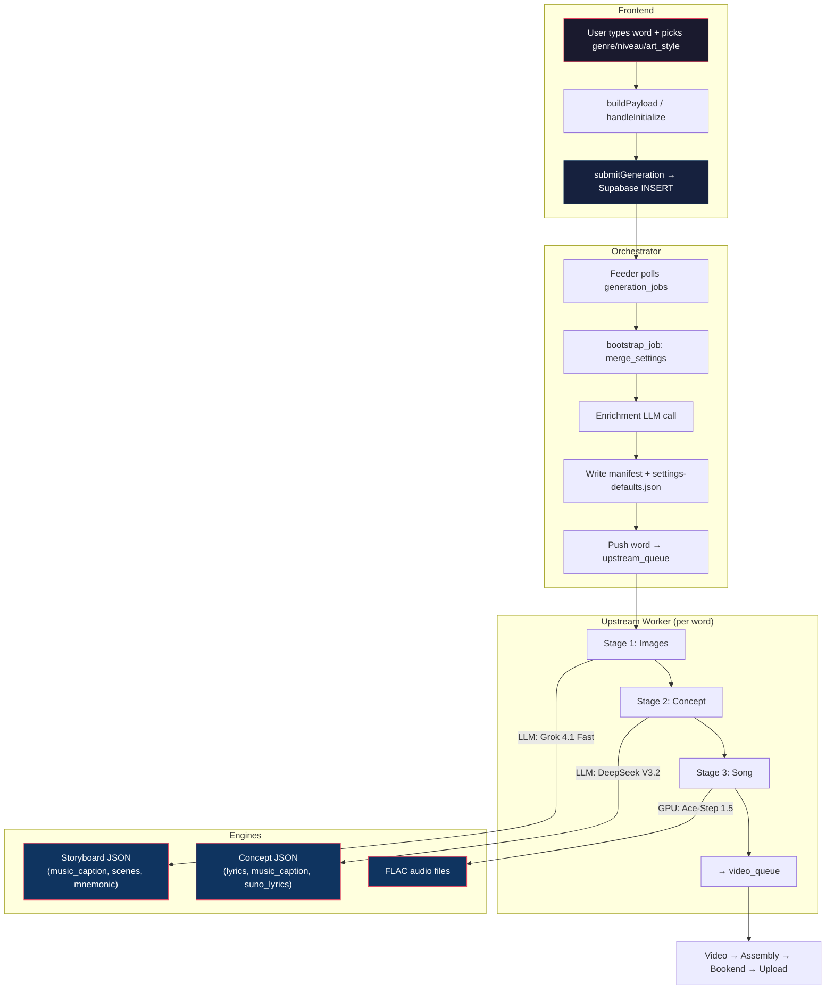
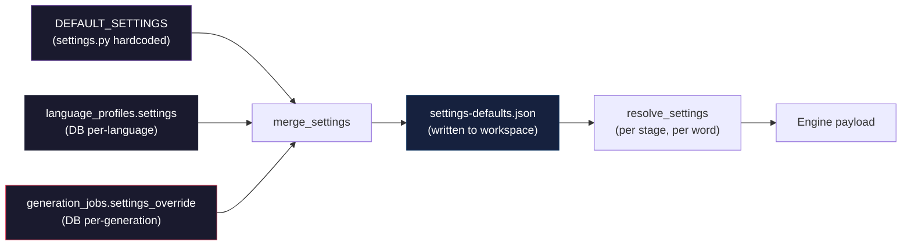
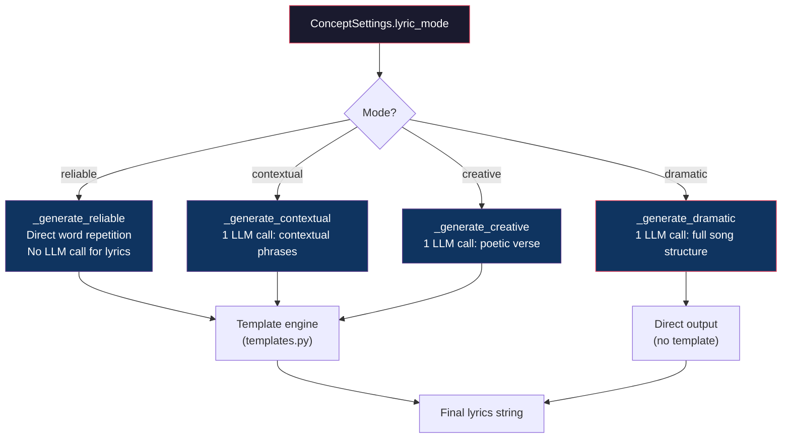
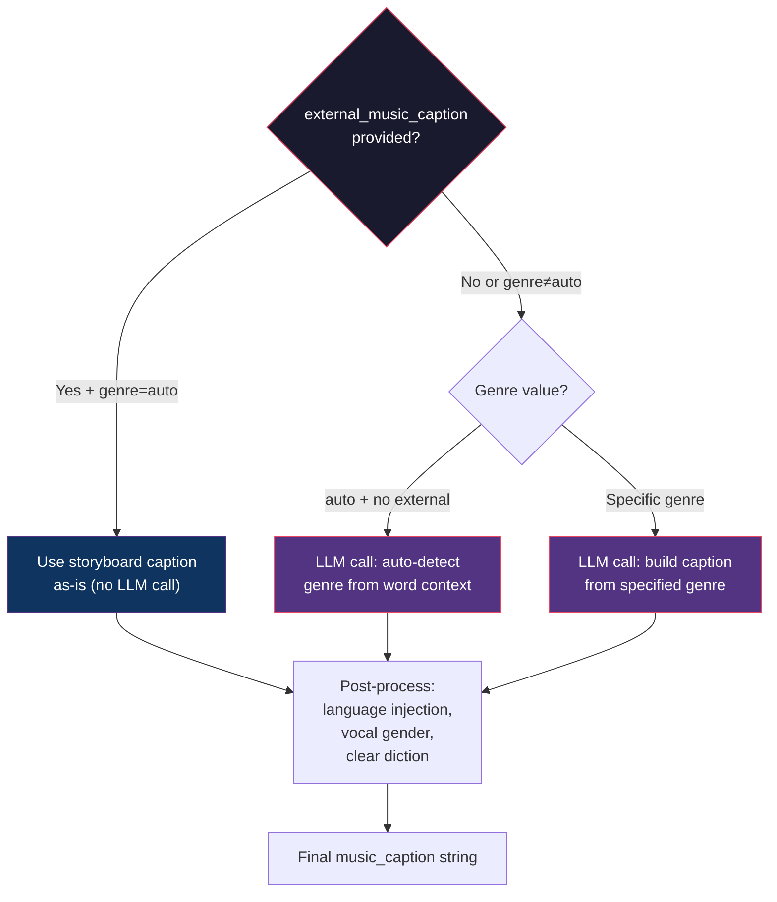
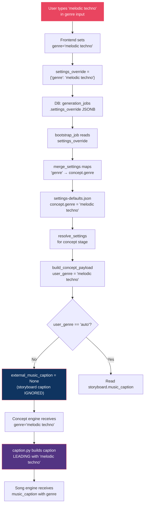
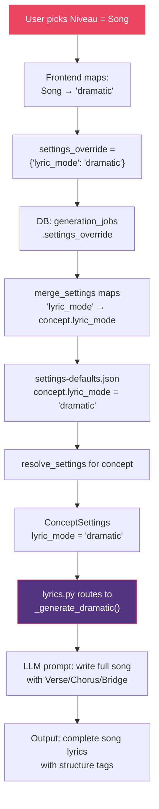

# Pipeline Map — Lyrics, Music Caption & Genre

> **Read-only reference for Sir Robert and future agents.**
> Maps every LLM call, settings hop, injection point, and output composition rule
> from user word input to final song generation.
>
> Generated: 2026-04-22 · Source commit: `dfc0b5e` (main)

---

## Table of Contents

1. [End-to-End Overview](#1-end-to-end-overview)
2. [Frontend Payload Assembly](#2-frontend-payload-assembly)
3. [Settings Resolution Chain](#3-settings-resolution-chain)
4. [Stage 1 — Image Engine (Storyboard + Music Caption)](#4-stage-1--image-engine)
5. [Stage 2 — Concept Engine (Lyrics + Caption)](#5-stage-2--concept-engine)
6. [Stage 3 — Song Engine (Ace-Step)](#6-stage-3--song-engine)
7. [Suno Bake-In (Optional)](#7-suno-bake-in)
8. [LLM Call Inventory](#8-llm-call-inventory)
9. [Genre Override Path — Complete Trace](#9-genre-override-path)
10. [Niveau (Lyric Mode) Path — Complete Trace](#10-niveau-lyric-mode-path)
11. [Silent Drop Risks](#11-silent-drop-risks)

---

## 1. End-to-End Overview



### Pipeline Order

| Order | Stage | Engine | LLM/GPU | Primary Output |
|-------|-------|--------|---------|----------------|
| 0 | Enrichment | OpenRouter | DeepSeek V3.2 | translation, mnemonic, pos, etymology |
| 1 | Images | OpenRouter | Grok 4.1 Fast | `storyboard.json` (scenes + `music_caption`) |
| 2 | Concept | OpenRouter | DeepSeek V3.2 | `concept.json` (lyrics + `music_caption`) |
| 3 | Song | RunPod GPU | Ace-Step 1.5 | FLAC takes |
| 3b | Suno (opt) | kie.ai | Suno V5.5 | MP3 (A/B tracks) |

---

## 2. Frontend Payload Assembly

Two skins assemble the same `GeneratePayload` shape. The critical field is `settings_override`.

### Glassy Skin (`GenerateGO.tsx`)

```typescript
// Lines 270-301 — handleInitialize
const genreValue =
  isQuickGenerate ? undefined
    : genre === 'auto' ? undefined
    : genre === 'custom' ? customGenre.trim() || undefined
    : genre || undefined

jobPayload.settings_override = {
  ...(creativeDirection ? { creative_direction: creativeDirection } : {}),
  ...(genreValue ? { genre: genreValue } : {}),
  ...(lyricMode ? { lyric_mode: lyricMode } : {}),
}
```

### Classic Skin (`GeneratePG.tsx` via `useWizardState.ts`)

```typescript
// useWizardState.ts lines 159-187 — buildPayload
const genre = state.genre === 'auto' ? undefined : state.genre || undefined
const lyricMode = state.lyricMode || undefined

jobPayload.settings_override = {
  ...(creativeDirection ? { creative_direction: creativeDirection } : {}),
  ...(genre ? { genre } : {}),
  ...(lyricMode ? { lyric_mode: lyricMode } : {}),
}
```

### Key: `settings_override` → DB column

`submitGeneration.ts` writes to `generation_jobs.settings_override` (JSONB).
This column is read verbatim by `bootstrap_job` on the backend.

---

## 3. Settings Resolution Chain



### 3.1 `merge_settings` (job_runner.py:106-135)

**Priority: DEFAULT_SETTINGS < profile_settings < settings_override**

```python
SETTINGS_OVERRIDE_MAP = {
    "genre":              ("concept", "genre"),
    "lyric_mode":         ("concept", "lyric_mode"),
    "creative_direction": ("images",  "creative_direction"),
    "art_style":          ("images",  "art_style"),
    "visual_reference":   ("images",  "visual_reference"),
    "frame_narrative":    ("images",  "frame_narrative"),
}
```

Only keys listed in `SETTINGS_OVERRIDE_MAP` are routed from `settings_override` to their target stage. **Any key not in this map is silently dropped.**

### 3.2 `resolve_settings` (settings.py:147-159)

Called per-stage in `pipeline.py:run_stage`. Merges workspace `settings-defaults.json` (batch-level) with `manifest.settings` (per-word overrides). Word wins; null overrides fall through to batch default.

### 3.3 Concept Settings Defaults

| Setting | Default | Source |
|---------|---------|--------|
| `genre` | `"auto"` | `DEFAULT_SETTINGS["concept"]` |
| `lyric_mode` | `"reliable"` | `DEFAULT_SETTINGS["concept"]` |
| `vocal_gender` | `"female"` | `DEFAULT_SETTINGS["concept"]` |
| `duration` | `20` | `DEFAULT_SETTINGS["concept"]` |
| `llm_model` | `"deepseek/deepseek-v3.2"` | `DEFAULT_SETTINGS["concept"]` |
| `caption_style` | `"production"` | `DEFAULT_SETTINGS["concept"]` |

---

## 4. Stage 1 — Image Engine

> **File:** `cloud_engines/image_engine/prompts.py`
> **Model:** Grok 4.1 Fast (via OpenRouter) — `DEFAULT_SETTINGS["images"]["llm_model"]`

### 4.1 Music Caption Generation (Inside Storyboard LLM Call)

The image engine's storyboard LLM call generates `music_caption` as part of its JSON output.

**Prompt injection point:** `_music_caption_block()` (prompts.py:1174-1208)

```
MUSIC CAPTION (REQUIRED):
Generate a single-line music caption...
- Lead with the genre, mood, and musical style
- Include "{vocal} vocal" and "singing in {language}" early
- Keep instrumentation focused — name 1-2 specific instruments
- End with "clear diction" for vocal clarity
- Be 15-30 words, single line
```

**Art-style music hints** are injected for select styles:
- ghibli → gentle piano, strings, woodwinds
- cyberpunk → synthwave, electronic
- noir → smoky jazz, muted brass

**Output location:** `storyboard.json` → `music_caption` field

### 4.2 Storyboard → Concept Bridge

The storyboard's `music_caption` is read by `build_concept_payload` (pipeline.py:197-242):

```python
user_genre = settings.get("genre") or "auto"
external_music_caption = None
if images_version and user_genre == "auto":
    storyboard_file = word_dir / "images" / images_version / "storyboard.json"
    if storyboard_file.exists():
        external_music_caption = storyboard.get("music_caption")
```

**Critical rule:** `external_music_caption` is ONLY inherited when `genre == "auto"`.
When the user sets a custom genre, the storyboard caption is **ignored** — the concept engine generates its own from the genre.

---

## 5. Stage 2 — Concept Engine

> **Files:** `cloud_engines/concept_engine/lyrics.py`, `templates.py`, `caption.py`, `models.py`
> **Model:** DeepSeek V3.2 (via OpenRouter) — `ConceptSettings.llm_model`

### 5.1 Concept Engine Input Contract

```python
class ConceptInput(BaseModel):
    word: str              # The vocabulary word
    translation: str       # English translation
    language: str          # Full language name
    language_code: str     # ISO 639-1
    external_music_caption: str | None  # From storyboard (when genre=auto)
    mnemonic: str          # From enrichment
    pos: str               # Part of speech
    input_type: str        # "word" or "phrase"
```

### 5.2 Lyric Mode Routing (Niveau)



#### Mode Details

| Mode | UI Name | LLM Calls | Template? | Output Shape |
|------|---------|-----------|-----------|-------------|
| `reliable` | Standard | 0 for lyrics | Yes | `[Intro] word` repeated patterns |
| `contextual` | Phrase | 1 | Yes | Short contextual phrases woven into structure |
| `creative` | Story | 1 | Yes | Poetic verses with word fragments |
| `dramatic` | Song | 1 | No (direct) | Full `[Verse]/[Chorus]/[Bridge]` song |

### 5.3 Template Engine (`templates.py`)

Used by `reliable`, `contextual`, and `creative` modes. The template engine constructs lyrics from structural blocks:

**Key functions:**
- `build_lyrics()` — master assembly, picks section patterns based on duration
- `_section_*()` — individual section builders (intro, verse, chorus, bridge, outro)
- `_fragment_line()` — extracts syllable fragments with optional `syllable_chop`
- `_filler_word()` — injects language-specific filler words (e.g., "la", "na", "oh")

**Duration → Structure mapping** (templates.py):
| Duration | Typical Structure |
|----------|-------------------|
| 15s | `[Intro] + [Verse]` |
| 20s | `[Intro] + [Verse] + [Chorus]` |
| 30s | `[Intro] + [Verse] + [Chorus] + [Bridge] + [Outro]` |

### 5.4 Music Caption Generation (`caption.py`)

The concept engine generates its own `music_caption` via a **separate LLM call** using `build_music_caption()`.



**Caption prompt construction** (`caption.py`):
- System prompt defines the role as a "music production assistant"
- User prompt includes: word, translation, language, vocal_gender, genre (if specified)
- `caption_style` controls verbosity: `"production"` (default) vs `"minimal"`
- Post-processing ensures language name + vocal gender + "clear diction" are always present

### 5.5 Concept Engine Output

```json
{
  "lyrics": "[Intro]\nword\n\n[Verse]\n...",
  "suno_lyrics": "[Intro]\nword\n\n[Verse]\n...",
  "music_caption": "melodic techno, female vocal singing in German, warm analog pad, 90 BPM, clear diction",
  "genre": "melodic techno",
  "vocal_gender": "female",
  "duration": 20,
  "lyric_mode": "reliable",
  "template_mode": "standard",
  "word": "Wort",
  "language": "German"
}
```

The `suno_lyrics` field may differ from `lyrics` — it's optimized for Suno's model (longer, more natural phrasing). When absent, `lyrics` is used as fallback.

---

## 6. Stage 3 — Song Engine

> **Files:** `cloud_engines/song_engine/models.py`, `language.py`
> **Runtime:** Ace-Step 1.5 on RunPod GPU

### 6.1 Song Payload Assembly (`pipeline.py:245-274`)

```python
payload = {
    "content": {
        "lyrics": concept.get("lyrics", ""),        # From concept JSON
        "music_caption": concept.get("music_caption", ""),  # From concept JSON
        "language_code": manifest_data.language_code,
    },
    "settings": settings,  # Resolved song settings (duration, batch_size, etc.)
}
```

### 6.2 Language Lock (`language.py`)

Before Ace-Step inference, the song engine applies two safety layers:

1. **Layer 1 — Code validation:** `validate_language_code()` checks against `VALID_LANGUAGES` dict (46 languages)
2. **Layer 2 — Caption safety net:** `ensure_language_in_caption()` appends `, {Language} vocal` if no language signal found
3. **Language tag injection:** `inject_language_tags()` prepends `[{lang_code}]` to every lyric line

**Language remapping:** `ACESTEP_LANG_REMAP` maps unsupported codes (e.g., `ceb` → `tl`)
**Caption remapping:** `ACESTEP_CAPTION_LANG_REMAP` rewrites language names (e.g., `Bisaya` → `Filipino`)

### 6.3 Song Settings

| Setting | Default | Constraint |
|---------|---------|-----------|
| `duration` | 30 | Must be 15, 20, or 30 |
| `batch_size` | 4 | 1-8 takes per call |
| `inference_steps` | 50 | 32-100 |
| `guidance_scale` | 7.5 | 5.0-10.0 |
| `thinking` | true | LM audio code gen |
| `seed` | -1 | -1=random, int=fixed |
| `lora_path` | null | LoRA adapter path |

---

## 7. Suno Bake-In

> **File:** `src/suno.py`
> **Provider:** kie.ai API → Suno V5.5

Suno runs **after** the song stage, triggered by `_post_song_suno_submit` in `upstream_worker.py:300-355`.

### 7.1 Suno Payload

```python
payload = {
    "prompt": lyrics,                    # From concept.suno_lyrics or concept.lyrics
    "style": music_caption[:1000],       # From concept.music_caption
    "title": word[:80],
    "customMode": True,
    "model": "V5_5",
    "vocalGender": "m" or "f",           # From concept.vocal_gender
    "callBackUrl": "https://resonanz.pro/api/suno/callback",
}
```

**Caption sanitization for Suno:**
- Strips `", clear diction"` (may trigger copyright filter)
- Remaps `Bisaya/Cebuano` → `Filipino`

### 7.2 Suno Flow

```
submit_song() → kie.ai POST /generate → task_id
  ↓
generate_song() polls GET /record-info every 10s (max 180s)
  ↓
SUCCESS → writes suno_audio_url + suno_audio_url_b to words table
FAIL (copyright) → retry with simplified payload (bare word + "pop" style)
```

---

## 8. LLM Call Inventory

| # | Stage | Purpose | Model | File | Max Tokens | Notes |
|---|-------|---------|-------|------|-----------|-------|
| 1 | Enrichment | Word metadata | DeepSeek V3.2 | `services/enrichment.py` | ~512 | Batch call for all words |
| 2 | Images | Creative direction picker | DeepSeek V3.2 | `pipeline.py:95-164` | 200 | Only when `creative_direction=auto` |
| 3 | Images | Storyboard + music_caption | Grok 4.1 Fast | `image_engine/storyboard.py` | ~4096 | Generates scenes + music_caption |
| 4 | Concept | Contextual/creative lyrics | DeepSeek V3.2 | `concept_engine/lyrics.py` | 256 | Only for contextual/creative modes |
| 5 | Concept | Dramatic lyrics | DeepSeek V3.2 | `concept_engine/lyrics.py` | 256 | Only for dramatic mode |
| 6 | Concept | Music caption | DeepSeek V3.2 | `concept_engine/caption.py` | 256 | Skipped when external_music_caption provided + genre=auto |

**Total LLM calls per word (typical):**
- Genre=auto, mode=reliable: 3 calls (enrichment + storyboard + caption-passthrough)
- Genre=custom, mode=dramatic: 4 calls (enrichment + storyboard + dramatic-lyrics + caption)

---

## 9. Genre Override Path — Complete Trace



---

## 10. Niveau (Lyric Mode) Path — Complete Trace



**Niveau UI → Backend mapping:**
| UI Label | `lyric_mode` value | Template? |
|----------|-------------------|-----------|
| Standard | `reliable` | Yes |
| Phrase | `contextual` | Yes |
| Story | `creative` | Yes |
| Song | `dramatic` | No |

---

## 11. Silent Drop Risks

### 11.1 `SETTINGS_OVERRIDE_MAP` Gatekeeping

Any setting in `settings_override` that is **not** in `SETTINGS_OVERRIDE_MAP` (job_runner.py:93-103) is silently discarded. Current allowed keys:

```
genre, lyric_mode, creative_direction, art_style, visual_reference, frame_narrative
```

**Risk:** If a new frontend wizard step writes a new key to `settings_override` without adding it to the map, the value reaches the DB but never reaches the engine.

### 11.2 Genre "auto" Trap

When `genre === "auto"`, the frontend omits it from `settings_override` entirely (both skins). The backend default `"auto"` takes effect. This is **correct behavior** but means:

- If the frontend accidentally sends `genre: "auto"` as a string, `merge_settings` would write `concept.genre = "auto"`, which is the same as the default — no harm done.
- If the frontend sends `genre: ""`, `merge_settings` skips it (`value == ""`).

### 11.3 Storyboard Caption Override

When `genre ≠ "auto"`, the storyboard's `music_caption` is **completely ignored** by `build_concept_payload`. The concept engine generates a fresh caption from the genre. This is by design but means:

- The music won't necessarily match the visual mood of the storyboard
- The storyboard's art-style-to-music hints (ghibli→piano, etc.) are bypassed

### 11.4 `ConceptSettings` Pydantic Validation

`ConceptSettings` (models.py) validates and coerces incoming settings. Fields not declared in the model are dropped by Pydantic. Current validated fields:

```
lyric_mode, genre, vocal_gender, duration, caption_style,
syllable_chop, visual_hint, use_art_style, art_style_hint, llm_model
```

### 11.5 LoRA Constraints on Song Engine

When a LoRA adapter is active, `thinking` and `cot` may be force-disabled by the song engine. This is tracked in `GenerationMetaLora.constraints_applied` but is invisible to the concept engine.

---

## Appendix A — File Reference

| File | Role |
|------|------|
| `frontend/src/pages/GenerateGO.tsx` | Glassy skin wizard + payload assembly |
| `frontend/src/pages/GeneratePG.tsx` | Classic skin wizard + payload assembly |
| `frontend/src/components/generate/useWizardState.ts` | Classic skin state + `buildPayload` |
| `frontend/src/components/generate/submitGeneration.ts` | DB insert (deck + words + job) |
| `job_runner.py` | Orchestrator entry, `SETTINGS_OVERRIDE_MAP`, `merge_settings` |
| `src/settings.py` | `DEFAULT_SETTINGS`, `resolve_settings`, `load_defaults` |
| `src/orchestration/feeder.py` | Job bootstrap, enrichment, manifest creation |
| `src/orchestration/upstream_worker.py` | Stage sequencing (images → concept → song) |
| `src/pipeline.py` | Payload builders, `run_stage`, creative direction picker |
| `cloud_engines/concept_engine/lyrics.py` | Lyric generation (4 modes) |
| `cloud_engines/concept_engine/templates.py` | Template engine (reliable/contextual/creative) |
| `cloud_engines/concept_engine/caption.py` | Music caption LLM call |
| `cloud_engines/concept_engine/models.py` | `ConceptSettings`, `ConceptInput`, `ConceptOutput` |
| `cloud_engines/concept_engine/llm_client.py` | OpenRouter API client |
| `cloud_engines/image_engine/prompts.py` | Storyboard system prompt + `_music_caption_block` |
| `cloud_engines/image_engine/storyboard.py` | Storyboard LLM orchestration |
| `cloud_engines/song_engine/models.py` | `SongPayload`, `SongSettings` |
| `cloud_engines/song_engine/language.py` | Language lock, tag injection, remapping |
| `src/suno.py` | Suno bake-in (submit, poll, callback) |

## Appendix B — Environment Variables (Lyrics-Relevant)

| Variable | Used By | Purpose |
|----------|---------|---------|
| `OPENROUTER_API_KEY` | llm_client.py, pipeline.py | LLM API authentication |
| `KIE_API_KEY` | suno.py | Suno/kie.ai authentication |
| `POD_URL` | dispatcher.py | GPU pod endpoint |
| `POD_AUTH_TOKEN` | dispatcher.py | GPU pod auth |
