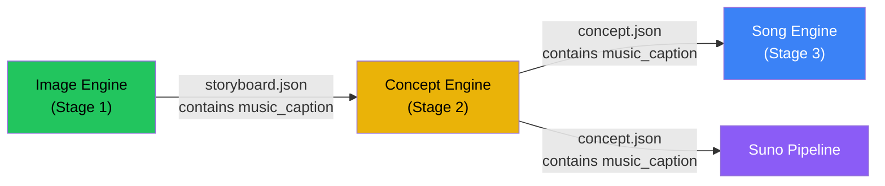

# Concept Engine Data Flow Audit

> **Status:** READ-ONLY Investigation — No code changes  
> **Date:** 2026-04-07

---

## Part 1: Concept Engine Output Schema

The `ConceptArtifact` model ([models.py L160-171](file:///d:/CODING/ResonanceTEST/engines/concept-engine/src/models.py#L160-L171)) defines the JSON written to disk:

```python
class ConceptArtifact(BaseModel):
    word: str                          # Echo of input
    translation: str                   # Echo of input
    language: str                      # Echo of input
    language_code: str                 # Echo of input
    lyrics: str                        # Generated lyrics (ACE-Step format)
    suno_lyrics: str | None = None     # Suno-specific lyrics (simplified format)
    music_caption: str                 # Music style description for audio generation
    visual_hint: str | None = None     # DEPRECATED — always None
    generation_info: GenerationInfo    # Metadata about how it was generated
```

### Field-by-Mode Breakdown

| Field | reliable | minimal | standard | dramatic | contextual | creative |
|-------|----------|---------|----------|----------|------------|----------|
| `lyrics` | ✅ Template | ✅ Template | ✅ Template | ✅ Template | ✅ LLM | ✅ LLM |
| `suno_lyrics` | ✅ Always | ✅ Always | ✅ Always | ✅ Always | ✅ Always | ✅ Always |
| `music_caption` | ✅ External or LLM | ✅ External or LLM | ✅ External or LLM | ✅ External or LLM | ✅ LLM (combined) | ✅ LLM (combined) |
| `visual_hint` | ❌ Always None | ❌ Always None | ❌ Always None | ❌ Always None | ❌ Always None | ❌ Always None |
| `generation_info` | ✅ Always | ✅ Always | ✅ Always | ✅ Always | ✅ Always | ✅ Always |

> [!IMPORTANT]
> `visual_hint` is explicitly deprecated in the code: `visual_hint=None,  # DEPRECATED — storyboard handles visuals` ([engine.py L135](file:///d:/CODING/ResonanceTEST/engines/concept-engine/src/engine.py#L135))

---

## Part 2: Reliable Mode — Exact Output

### Execution Path

[lyrics.py L128-154](file:///d:/CODING/ResonanceTEST/engines/concept-engine/src/lyrics.py#L128-L154) → [templates.py L238-326](file:///d:/CODING/ResonanceTEST/engines/concept-engine/src/templates.py#L238-L326)

### LLM Calls in Reliable Mode

| Scenario | LLM Calls | Caption Source |
|----------|-----------|----------------|
| External caption provided + article known | **0** | Storyboard pass-through |
| External caption provided + no article | **1** | Storyboard (LLM used only for article discovery) |
| No external caption + article known | **1** | LLM-generated caption |
| No external caption + no article | **1** | LLM-generated caption + article |

### Concrete Example: "Hund" (German, 30s, production caption_style, article="der")

The call chain:
1. `generate_reliable("Hund", "der", 30, "production")` → pure template, no LLM
2. With external caption from storyboard → **0 total LLM calls**

**Output:**
```
[Verse - Steady]
der Hund...
Hund...

[Chorus - Building]
Hund!
der Hund!

[Outro - Fading]
der Hund...
```

**Artifact JSON:**
```json
{
  "word": "Hund",
  "translation": "dog",
  "language": "German",
  "language_code": "de",
  "lyrics": "[Verse - Steady]\nder Hund...\nHund...\n\n[Chorus - Building]\nHund!\nder Hund!\n\n[Outro - Fading]\nder Hund...",
  "suno_lyrics": "[Verse]\nder Hund\nHund\n\n[Chorus]\nder Hund\nHund\n\n[Outro]\nHund",
  "music_caption": "<from storyboard or LLM>",
  "visual_hint": null,
  "generation_info": {
    "lyric_mode": "reliable",
    "genre_mode": "auto",
    "syllable_count": 1,
    "word_length_class": "short",
    "llm_calls": 0,
    "lyrics_source": "template",
    "caption_source": "storyboard",
    "article_used": "der"
  }
}
```

### Fields populated vs. null in reliable mode

| Field | Status |
|-------|--------|
| `lyrics` | ✅ Always populated (template) |
| `suno_lyrics` | ✅ Always populated (template) |
| `music_caption` | ✅ Always populated (external or LLM) |
| `visual_hint` | ❌ Always `null` |
| `generation_info` | ✅ Always populated |

---

## Part 3: Downstream Consumption Map

> [!CAUTION]
> **Critical Discovery: The pipeline runs Images → Concept → Song, NOT Concept → Images.**
> 
> Stage order from [pipeline.py L28](file:///d:/CODING/ResonanceTEST/orchestrator/src/pipeline.py#L28): `STAGE_ORDER = ['images', 'concept', 'song', 'video', 'assembly', 'bookend']`
>
> The Image Engine runs FIRST and generates its own storyboard (including `music_caption`). The Concept Engine runs SECOND and can receive the Image Engine's `music_caption` as `external_music_caption`, acting as a **pass-through**.

---

### A. Song Engine

**Payload builder:** [build_song_payload() L219-248](file:///d:/CODING/ResonanceTEST/orchestrator/src/pipeline.py#L219-L248)

```python
concept = json.load(f)  # reads the concept JSON file
return {
    "content": {
        "lyrics": concept.get("lyrics", ""),       # ← READS
        "music_caption": concept.get("music_caption", ""),  # ← READS
        "word": manifest_data.word_original,        # from manifest, NOT concept
        "translation": manifest_data.translation,   # from manifest, NOT concept
        ...
    },
}
```

| Concept Field | Read by Song Engine? |
|---------------|---------------------|
| `lyrics` | ✅ **YES** — injected into ACE-Step as the vocal content |
| `music_caption` | ✅ **YES** — used as the style/genre prompt for ACE-Step |
| `suno_lyrics` | ❌ No |
| `visual_hint` | ❌ No |
| `generation_info` | ❌ No |
| `word` | ❌ No (uses manifest) |
| `translation` | ❌ No (uses manifest) |

---

### B. Image Engine

**Payload builder:** [build_image_payload() L251-282](file:///d:/CODING/ResonanceTEST/orchestrator/src/pipeline.py#L251-L282)

```python
return {
    "content": {
        "word": manifest_data.word_original,         # from manifest
        "translation": manifest_data.translation,    # from manifest
        "language": manifest_data.language,           # from manifest
        "language_code": manifest_data.language_code, # from manifest
    },
    "context": context,  # mnemonic/etymology from MANIFEST ENRICHMENT
    ...
}
```

> [!WARNING]
> **The Image Engine reads ZERO fields from the Concept Engine artifact.**
> 
> It runs *before* the Concept Engine in the pipeline. All its inputs come from the manifest (word, translation, language) and manifest enrichment (mnemonic, etymology). It generates its own storyboard and music_caption via its own independent LLM call.

| Concept Field | Read by Image Engine? |
|---------------|----------------------|
| `lyrics` | ❌ No |
| `music_caption` | ❌ No — Image Engine **generates its own** |
| `visual_hint` | ❌ No (deprecated anyway) |
| All others | ❌ No |

**Context comes from manifest enrichment, NOT concept:**
```python
# pipeline.py L258-264 — reads from manifest.enrichment, not concept
enrich = manifest_data.enrichment
mnemonic = (enrich.mnemonic or None) if enrich else None
etymology = (enrich.etymology or None) if enrich else None
if mnemonic or etymology:
    context = {"mnemonic": mnemonic, "etymology": etymology}
```

---

### C. Video Engine

**Payload builder:** [build_video_payloads() L285-453](file:///d:/CODING/ResonanceTEST/orchestrator/src/pipeline.py#L285-L453)

The Video Engine reads:
- `word`, `translation`, `language`, `language_code` — from **manifest**
- `image_path`, `video_prompt`, `camera_motion` — from **images/storyboard**

| Concept Field | Read by Video Engine? |
|---------------|----------------------|
| All fields | ❌ **No** — zero concept data reaches the Video Engine |

---

### D. Assembly Engine

**Payload builder:** [build_assembly_payload() L661-700](file:///d:/CODING/ResonanceTEST/orchestrator/src/pipeline.py#L661-L700)

```python
return {
    "content": {
        "song_path": str(song_path),     # from songs directory
        "video_clips": video_clips,       # from videos directory
        "word": manifest_data.word_original,      # from manifest
        "translation": manifest_data.translation, # from manifest
        ...
    },
}
```

| Concept Field | Read by Assembly Engine? |
|---------------|-------------------------|
| All fields | ❌ **No** — only reads song files + video clips + manifest |

---

### E. Bookend Engine

**Payload builder:** [build_bookend_payload() L703-733](file:///d:/CODING/ResonanceTEST/orchestrator/src/pipeline.py#L703-L733)

```python
return {
    "content": {
        "assembled_video": assembled_video,           # from final directory
        "word": manifest_data.word_original,           # from manifest
        "translation": manifest_data.translation,      # from manifest
        ...
    },
}
```

| Concept Field | Read by Bookend Engine? |
|---------------|------------------------|
| All fields | ❌ **No** — only reads assembled video path + manifest |

---

### F. Suno Pipeline

**Reader:** [suno.py L53-116](file:///d:/CODING/ResonanceTEST/orchestrator/src/suno.py#L53-L116)
**Payload builder:** [suno.py L119-141](file:///d:/CODING/ResonanceTEST/orchestrator/src/suno.py#L119-L141)

```python
# suno.py L89 — reads concept JSON directly
lyrics = concept.get("suno_lyrics") or concept.get("lyrics", "")
music_caption = concept.get("music_caption", "")
```

```python
# suno.py L132-141 — maps to kie.ai API
return {
    "prompt": lyrics,                   # ← suno_lyrics or lyrics
    "style": style[:1000],              # ← music_caption (cleaned)
    "title": title[:80],                # ← word
    ...
}
```

| Concept Field | Read by Suno? |
|---------------|---------------|
| `suno_lyrics` | ✅ **YES** — primary lyrics source for Suno API |
| `lyrics` | ✅ **YES** — fallback if `suno_lyrics` is absent |
| `music_caption` | ✅ **YES** — used as the `style` parameter |
| `word` | ❌ No (uses manifest — but concept `word` would match) |
| All others | ❌ No |

> [!NOTE]
> Suno generates its song completely independently of ACE-Step. It uses the same `music_caption` but its own simpler `suno_lyrics` format (5 repetitions across Verse/Chorus/Outro). It does NOT generate its own caption — it reuses the Concept Engine's.

---

## Part 4: Double Generation Check

### Music Caption: Who Actually Generates It?



**The Image Engine generates the music_caption.** Here's the exact flow:

1. **Image Engine** runs its storyboard LLM call → storyboard output includes `music_caption` field ([models.py L374](file:///d:/CODING/ResonanceTEST/engines/image-engine/src/models.py#L374)) → written to `storyboard.json`

2. **Orchestrator** reads `storyboard.json` when building the concept payload:
   ```python
   # pipeline.py L192-196
   storyboard = json.load(f)
   external_music_caption = storyboard.get("music_caption")
   ```

3. **Concept Engine** receives this as `external_music_caption` → passes through to its artifact unchanged:
   ```python
   # lyrics.py L131-134 — reliable mode with external caption
   caption_result = CaptionResult(
       caption=external_music_caption, source="storyboard", ...
   )
   ```

4. **Song Engine** reads `music_caption` from the concept artifact → uses it for ACE-Step.

5. **Suno** reads `music_caption` from the concept artifact → uses it as `style`.

> [!IMPORTANT]
> **The Concept Engine is a pass-through for `music_caption` in the normal pipeline.** The Image Engine's storyboard LLM call generates it. The Concept Engine only generates its own caption as a fallback when no storyboard exists.

### Storyboard: Independent Generation Confirmed

The Image Engine generates its storyboard **completely independently** of the Concept Engine:

- [storyboard.py L36-136](file:///d:/CODING/ResonanceTEST/engines/image-engine/src/storyboard.py#L36-L136): Takes `content` (word, translation, language) + `context` (etymology, mnemonic from manifest) + `settings` → makes its own LLM call → returns `Storyboard`
- The Concept Engine's `visual_hint` is **never passed** to the Image Engine (it's deprecated and always null anyway)
- The Image Engine's prompt system ([prompts.py L17-112](file:///d:/CODING/ResonanceTEST/engines/image-engine/src/prompts.py#L17-L112)) builds prompts from scratch using `word`, `translation`, `language`, and enrichment data

### What the Image Engine's LLM Call Receives as Context

From [prompts.py _context_block L818-841](file:///d:/CODING/ResonanceTEST/engines/image-engine/src/prompts.py#L818-L841):

| Input | Source | Used In Image Prompts? |
|-------|--------|----------------------|
| `word` | Manifest | ✅ Primary subject |
| `translation` | Manifest | ✅ Meaning context |
| `language` | Manifest | ✅ Script/cultural context |
| `mnemonic` | Manifest enrichment | ✅ If `visual_reference != "none"` |
| `etymology` | Manifest enrichment | ✅ If `visual_reference != "none"` |
| `music_caption` | `context.music_caption` | ✅ Used as "Musical mood" hint |
| `visual_hint` | `context.visual_hint` | ✅ Used as "Visual mood seed" |
| `lyrics` | `context.lyrics` | ✅ Used as "Song lyrics for reference" |

> [!NOTE]
> **However**, in the actual pipeline, `context` from `build_image_payload()` only contains `mnemonic` and `etymology`. The `visual_hint`, `lyrics`, and `music_caption` context fields are only populated by the standalone UI app, not by the orchestrator pipeline. The orchestrator explicitly does NOT pass these fields.

---

## Part 5: Frontend Display

### Orchestrator Frontend (Local)

Searched all `.tsx` and `.ts` files in `d:\CODING\ResonanceTEST\orchestrator\frontend\src\`:

| Search Term | Found? | Where? |
|-------------|--------|--------|
| `etymology` | ❌ **Not found** | — |
| `mnemonic` | ❌ **Not found** | — |
| `generation_info` | ❌ **Not found** | — |
| `syllable` | ❌ **Not found** | — |
| `lyrics_source` | ❌ **Not found** | — |
| `caption_source` | ❌ **Not found** | — |
| `visual_hint` | ❌ **Not found** | — |

The frontend `ConceptArtifact` TypeScript type ([api.ts L34-43](file:///d:/CODING/ResonanceTEST/orchestrator/frontend/src/api.ts#L34-L43)) declares these fields:
```typescript
export interface ConceptArtifact {
  word: string
  translation: string
  language: string
  language_code: string
  lyrics: string
  music_caption: string
  visual_hint: string | null
  generation_info?: Record<string, unknown>
}
```

But **no component renders `generation_info`, `visual_hint`, or any enrichment-sourced concept data to the user**. The `ConceptArtifact` type is used only for the concept editing UI (viewing/editing lyrics and music_caption).

### Cloud Frontend (Supabase)

The `words` table stores `mnemonic` and `etymology` as columns, but these come from CSV import / word creation — NOT from the Concept Engine.

---

## Consumption Matrix (Deliverable)

| Field | Produced By | Consumed By | Verdict |
|-------|------------|-------------|---------|
| `lyrics` | Concept Engine (template or LLM) | **Song Engine** (ACE-Step vocals), **Suno** (fallback) | 🟢 **ACTIVE** |
| `suno_lyrics` | Concept Engine (template, always) | **Suno Pipeline** (primary lyrics source) | 🟢 **ACTIVE** |
| `music_caption` | **Image Engine** (storyboard LLM) → passed through Concept Engine | **Song Engine** (ACE-Step style), **Suno** (style param) | 🟡 **REDUNDANT** — Concept Engine is just a pass-through; Image Engine is the real producer |
| `visual_hint` | Concept Engine (DEPRECATED — always `null`) | Nothing | 🔴 **DEAD** |
| `generation_info` | Concept Engine (always populated) | Nothing downstream; only concept-engine test files and dev UI | 🔴 **DEAD** (diagnostics only) |
| `word` | Concept Engine (echo of input) | Nothing (downstream reads from manifest) | 🔴 **DEAD** (redundant echo) |
| `translation` | Concept Engine (echo of input) | Nothing (downstream reads from manifest) | 🔴 **DEAD** (redundant echo) |
| `language` | Concept Engine (echo of input) | Nothing (downstream reads from manifest) | 🔴 **DEAD** (redundant echo) |
| `language_code` | Concept Engine (echo of input) | Nothing (downstream reads from manifest) | 🔴 **DEAD** (redundant echo) |

### Enrichment Fields (NOT Concept Engine Output)

| Field | Stored In | Consumed By | Note |
|-------|----------|-------------|------|
| `etymology` | Manifest enrichment (CSV import) | **Image Engine** (visual_reference prompt), Concept Engine (NOT used) | NOT a concept output |
| `mnemonic` | Manifest enrichment (CSV import) | **Image Engine** (visual_reference prompt), **Concept Engine** (article extraction only) | NOT a concept output |
| `syllable_info` | Internal to Concept Engine (not in artifact) | Nothing downstream | Never written to artifact JSON |

---

## Key Insights

> [!CAUTION]
> ### 1. The Concept Engine is mostly a pass-through
> In the production pipeline (reliable mode + storyboard caption), the Concept Engine makes **ZERO LLM calls** and produces:
> - Template-based lyrics (pure string interpolation)
> - A `music_caption` that's literally copied from the Image Engine's storyboard
> - A `suno_lyrics` that's another template (word repeated 5×)
> 
> **It adds almost no intelligence to the pipeline in reliable mode.**

> [!IMPORTANT]
> ### 2. Only 2 of 9 artifact fields have real consumers
> `lyrics` → Song Engine, `music_caption` → Song Engine + Suno. Everything else (`visual_hint`, `generation_info`, echo fields) is dead data.
> 
> `suno_lyrics` has exactly ONE consumer (the Suno pipeline via kie.ai), which is a secondary feature.

> [!TIP]
> ### 3. Phrase mode impact is smaller than expected
> Since the Concept Engine is mostly a template engine in reliable mode, phrase support requires:
> - **Template changes**: Make `generate_reliable()` phrase-aware → trivial (just string interpolation with the phrase)
> - **`generate_suno_lyrics()`**: Same — trivial template change
> - **Syllable analysis**: Only used for mode routing in non-reliable modes. In reliable mode, syllable analysis runs but `word_length_class` has no effect (reliable templates are word-length-agnostic)
> - **`count_word_occurrences()`**: Needs phrase-aware matching, but it's only used for `generation_info.word_repetitions` which is **dead data**
>
> **If we constrain phrase mode to reliable mode only, the Concept Engine changes are MINIMAL, not MAJOR_REWORK.**

### 4. The real music_caption authority is the Image Engine

The Image Engine's storyboard LLM call produces `music_caption` as part of its output schema. The Concept Engine's own caption generation is only a fallback path for when images haven't run yet (which doesn't happen in the normal pipeline).

### 5. Etymology and mnemonic are manifest data, not concept data

These fields flow: **CSV Import → Manifest → Image Engine (as context)**. The Concept Engine only reads `enrichment.mnemonic` for grammatical article extraction (e.g., extracting "der" from "DER Arzt (masculine)"). It never generates or transforms these fields.

---

## Revised Phrase Mode Effort (Concept Engine Only)

| Scenario | Effort | Rationale |
|----------|--------|-----------|
| Phrase mode in **reliable mode only** | 🟢 **0.5 days** | Templates are word-length-agnostic. Just pass the phrase through. Syllable analysis still runs but its output is unused in reliable mode. |
| Phrase mode in **all template modes** | 🟡 **1-2 days** | minimal/standard/dramatic modes branch on `word_length_class`. Need `analyze_phrase()` or skip syllable analysis for phrases. |
| Phrase mode in **all modes including LLM** | 🟡 **2-3 days** | contextual/creative LLM prompts reference "target word" and syllable count. Need prompt rewording for phrases. |

> [!TIP]
> **Recommendation**: Ship phrase mode for reliable mode first (0.5 days). This covers 90%+ of production use cases. Extend to other modes later.
