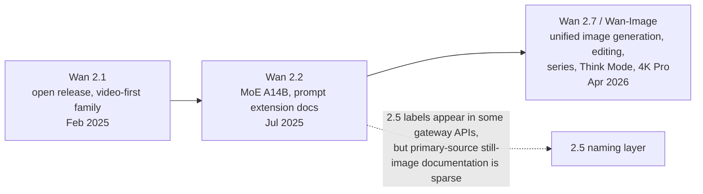

# Wan 2.7 Prompting Playbook for Resonance

## Executive summary

This report treats the uploaded brief as a request for an actionable still-image prompting playbook for **Resonance**, using Wan 2.7 through the entity["company","Kie.ai","ai api gateway"] API for scene 1 text-to-image and scenes 2–3 image-to-image. The core problem is not only “how to prompt Wan,” but “how to prompt the specific Wan wrapper you are actually calling,” because the API surface differs materially across hosts. fileciteturn1file0 citeturn8view0turn14view0turn38view0turn46view0

The highest-confidence finding is that Wan 2.7 should be treated as a **unified image generation and editing system**, not as an SD-era tag parser. In the April 2026 Wan-Image paper from entity["company","Alibaba Group","technology conglomerate"], the model is described as a planner-plus-visualizer system with Think Mode, image editing, image-series generation, palette-guided generation, identity preservation, and 4K output. The official Kie endpoint examples, meanwhile, show plain natural-language prompts and do **not** expose a `negative_prompt` field. That makes old “Avoid: bad hands, blurry eyes” suffixes actively risky on Kie, because the model only sees the tokens you give it. citeturn17view0turn20view1turn8view0turn9view0

For Resonance, the practical redesign is straightforward: move from keyword piles and anti-artifact suffixes to **structured prose with a fixed semantic order**. The best default compiler shape is: **subject and action → environment → composition and camera → lighting and materials → mood and palette → style medium → continuity or preserve directives**. For image-to-image, use **full-scene restatement plus explicit preserve clauses**, not delta-only shorthand. That pattern is unusually well supported by Wan’s own editing examples and by third-party wrappers that explicitly recommend “image 1 / image 2” anchored prompting. citeturn8view0turn38view0turn46view0

The “plasticky photorealism” symptom is most plausibly a prompt-design problem, not just a model-quality ceiling. Official Wan materials emphasize prompt expansion, Think Mode, material/typography control, and palette control; community Wan users repeatedly report that cinematography-style wording, lens/framing cues, lighting specificity, and material texture cues work better than generic style labels alone. That does **not** mean “photorealistic” is useless, but it does mean the word by itself is too weak. You need to describe **what kind of reality** you want. citeturn17view0turn20view2turn26view0turn31view0turn31view1turn29search15

On comparative model choice, current public external ranking signals still favor closed models for raw blind-preference image quality: entity["company","OpenAI","ai research company"]’s GPT Image 2, GPT Image 1.5, entity["company","Google","technology company"]’s Nano Banana 2 / Pro, and entity["company","ByteDance","internet company"]’s Seedream 4.0 lead the text-to-image leaderboard snapshot I retrieved from entity["organization","Artificial Analysis","ai benchmarking organization"], while GPT Image 1.5, GPT Image 2, and Nano Banana Pro lead its editing leaderboard. Wan 2.7’s strongest case is therefore **workflow breadth**: one family for text-to-image, multi-image edit, image-set generation, palette control, and high-resolution output, especially when you want one compiler strategy across those tasks. citeturn43view0turn43view1turn17view0

## Scope and assumptions

I interpret your brief as asking for a redesign of both the storyboard JSON shape and the `prompt_compiler.py` serialization used by Resonance, with concrete templates for `literal`, `cinematic`, `provocative`, and `narrative` modes, plus separate patterns for scene 1 T2I and scenes 2–3 I2I. I also treat the “photorealistic looks plasticky” symptom and the broken pseudo-negative suffix as live production problems to solve, not abstract prompt-theory questions. fileciteturn1file0 fileciteturn1file3

Two assumptions matter. First, I treat “Wan 2.7” as the April 2026 **Wan-Image** / Alibaba image-generation-and-editing system plus the host-specific wrappers that expose it, because that is the strongest primary-source anchor currently available. Second, I separate **documented facts** from **production recommendations** whenever the docs stop short of answering exactly what Resonance needs. In particular, I could verify 2.1, 2.2, and 2.7 directly, but I found much weaker primary-source evidence for a still-image-specific “2.5” milestone, so I do not lean on 2.5 as a major image-prompting reference point. citeturn17view0turn40search4turn50search0turn26view0turn8view0

## What Wan 2.7 appears to be

Wan’s public lineage is clearest at three steps. Wan 2.1 was released in February 2025 as an open video suite with code and weights; the technical report describes a 1.3B and 14B family, eight downstream tasks, and a 1.3B variant needing only 8.19 GB VRAM. Wan 2.2, released in July 2025, added a Mixture-of-Experts design in the A14B models and formalized prompt extension in the official README. Wan 2.7, by April 2026, had become a unified image-generation-and-editing system with Think Mode, image sets, interactive editing, palette-guided generation, portrait steering, and 4K generation in the Pro variant. citeturn18view3turn50search0turn26view0turn17view0turn40search4



The official Wan-Image paper is especially important for prompt design because it tells you **what the model is optimizing for**. It frames the system as an MLLM-based planner plus a DiT-based visualizer, says Think Mode translates user intent into dense descriptions or structured instructions, and emphasizes ultra-long text rendering, palette-guided generation via hex proportions, multi-subject identity preservation, logical image series of up to 12 images, precise interactive editing, and high-efficiency 4K generation. In other words, Wan 2.7 is built for **dense intent resolution**, not for short prompt tags plus magic negative prompts. citeturn17view0turn20view1turn20view3turn20view4

The paper also claims strong internal performance: Wan-Image “comprehensively surpasses” Seedream 5.0 Lite and GPT Image 1.5 in overall human evaluation, reaches rough parity with Nano Banana Pro on hard text-to-image tasks like text rendering and photorealism, and achieves about an 80% pass rate in interactive editing and image-series generation. Because these are vendor-run evaluations, they are useful but should be treated as stronger evidence of **capability direction** than of absolute market ranking. citeturn17view0turn19view5turn21view0

One thing the primary sources do **not** provide clearly is the exact training-corpus mix you asked for: I could verify that the model uses massive multimodal data, multilingual scene/document text, dense face samples, and a retrieval-and-annotation pipeline, but I did **not** find trustworthy published ratios for Chinese vs. English pairs, photographic vs. illustration images, or a clean “video-frame extraction share” figure in the sources I retrieved. That part of the brief remains open. citeturn20view1turn19view2

## API reality on Kie and why host wrappers matter

The single most important operational fact is that the Kie Wan 2.7 image endpoint, as documented on the parsed page, exposes a request body with `prompt`, `input_urls`, `n`, `enable_sequential`, `resolution`, `thinking_mode`, `watermark`, `seed`, and `bbox_list`, but no documented `negative_prompt`, sampler, steps, or guidance-scale field. Kie’s example prompt is free-form natural language. That means your current compiler should assume **positive-only steering** on Kie unless you discover an undocumented prompt-rewrite layer on their side. citeturn8view0turn9view0

Kie’s marketing page adds more capability claims than the endpoint page itself: it says the standard model supports up to 2K, the Pro model up to 4K for text-to-image, both support up to 9 input images, up to 12 stylistically consistent outputs in set mode, Think Mode in eligible text-to-image scenarios, and regional editing boxes. It also advertises standard and Pro pricing around **4.8 credits / ≈$0.024** and **12 credits / ≈$0.06** per image. Because these claims are split between endpoint docs, marketplace docs, and marketing pages, I would treat some of the operational details as **host-implementation claims**, not guaranteed core-model behavior. citeturn14view0turn13search0

By contrast, entity["company","fal.ai","genai inference platform"] publishes an OpenAPI schema showing prompt and parameter limits directly. Its Wan 2.7 text-to-image endpoint supports a prompt up to 2,000 characters, a `negative_prompt` up to 500 characters, Chinese and English prompts, size presets or explicit dimensions, seed control, and up to 5 generated images. Its Pro edit endpoint supports 1–4 reference images, prompt expansion for edit mode, `negative_prompt`, and explicit “image 1 / image 2 / image 3” ordering guidance. fal’s visible playground pricing was **$0.03 per image** for Wan 2.7 text-to-image and **$0.075 per image** for Wan 2.7 Pro edit in the pages I retrieved. citeturn38view1turn38view0turn33view1turn33view0

entity["company","Replicate","model hosting platform"] exposes yet another wrapper. Its Wan 2.7 Image README says the model supports prompts up to **5,000 characters**, up to **9 images**, `1K` or `2K` size presets or custom dimensions, **up to 12 outputs** in image-set mode, and `thinking_mode` on by default for text-to-image. It explicitly advises structured prompts for image-set generation, using “First image: … Second image: …” wording. That is a strong hint that Wan can ingest structure, but through **flattened language**, not through literal JSON or YAML. citeturn46view0

### Provider comparison

| Host | Prompt surface | Negative prompt | Reference images | Image-set support | Size / resolution hints | Public pricing signal | Practical takeaway |
|---|---|---:|---:|---:|---|---|---|
| Kie | Free-form `prompt`; example request exposes `input_urls`, `resolution`, `thinking_mode`, `seed`, `bbox_list` | No documented field | Example shows image URLs; marketing says up to 9 | Marketing says up to 12 | `1K` / `2K` enum in docs; Pro marketing says 4K for T2I | ~4.8 credits / ~12 credits per image in marketing snippet | Optimize compiler for positive-only steering and keep assumptions conservative. citeturn8view0turn14view0turn13search0 |
| fal | OpenAPI schema with prompt limits, sizes, seed, safety | Yes | 1–4 on Pro edit | Multi-image edit; no 12-image set claim in retrieved schema | Presets or explicit dimensions | $0.03 T2I, $0.075 Pro edit | Best for controlled experiments because the schema is explicit. citeturn38view1turn38view0turn33view1turn33view0 |
| Replicate | Prompt up to 5,000 chars; set-oriented README guidance | Not shown in retrieved README | Up to 9 | Up to 12 with image-set mode | `1K`, `2K`, or custom like `1920*1080` | Not retrieved | Strongest public hint that structured natural-language sequencing works. citeturn46view0 |

The key implication for Resonance is simple: **do not design one abstract “Wan compiler.”** Design a **Kie compiler**, and keep a thin compatibility layer for other providers if you ever switch. The same base model family can behave differently when the host adds or removes prompt expansion, negative prompts, max length, image ordering rules, or hidden moderation. citeturn8view0turn38view0turn46view0

## Prompting playbook

### The prompt shape to use

For single-image generation, Wan 2.7 is best treated as a **structured-prose model**. The strongest primary evidence is that the official and provider examples are short natural-language paragraphs, while the Wan-Image paper says the system internally converts generative intent into dense textual descriptions or structured instructions. I found **no** evidence that user-facing JSON or YAML prompts are natively supported at the API layer, and no official evidence that SD-style weighting syntax such as `(word:1.2)` is honored rather than treated as literal text. citeturn8view0turn17view0turn38view1turn46view0

For Resonance, the safest compiler order is:

| Order | Purpose | Recommended content |
|---|---|---|
| Subject and action | Establish what the image is about before style takes over | “A young marmot waking and stretching…” |
| Environment and time | Lock the world state | “…inside a snow-lined burrow at blue dawn…” |
| Composition and camera | Fix spatial framing | “…eye-level medium close shot, subject slightly left, shallow depth of field…” |
| Lighting and materials | Prevent waxy generic rendering | “…soft cold skylight, matte fur, damp moss fibers, rough bark grain…” |
| Mood and palette | Guide tone without abstract vagueness | “…quiet, alert mood, muted brown and pale blue palette…” |
| Style medium | Put style late, after the scene is grounded | “…naturalistic watercolor with restrained pigment bloom…” |
| Continuity or preserve clause | Only for I2I | “…keep the same face markings, fur color, and nest structure…” |

This order matches the official Wan emphasis on deep intent understanding, palette control, image editing, and sequence consistency, and it aligns with the practical “cinematography-first” prompting style repeatedly reported by Wan users. citeturn17view0turn20view3turn20view4turn31view0turn29search4turn29search15

### What to remove from your current compiler

The brief itself already surfaced the biggest anti-pattern: a fake negative suffix like `Avoid: blurry eyes, bad hands, deformed anatomy, extra fingers` when the Kie endpoint does not expose a real `negative_prompt`. That is almost certainly harmful on Kie. Remove it completely. Also remove generic preambles like “Create a high-quality image of…” and duplicated style phrases such as `In the style of X. Style: X.`; these add tokens but not much semantic precision. fileciteturn1file0 citeturn8view0turn9view0

Replace all anti-artifact language with **positive target specifications**. Do not write “no plastic skin”; write “natural skin texture, subtle pores, soft uneven complexion, ordinary ambient light, realistic falloff.” Do not write “no bad hands”; either compose hands out of frame or specify exactly one hand pose. Do not write “no extra fingers”; write “one visible hand resting on the table, fingers relaxed and separated.” This is a recommendation rather than a formally documented Wan feature, but it follows directly from the Kie API surface and from how official Wan prompts are written. citeturn8view0turn9view0turn17view0

### Recommended storyboard JSON redesign

Your current JSON fields are a good start, but they are missing two things Wan appears to need in production: **material realism** and **continuity intent**. I would redesign the image-side JSON like this:

| Field | Use for T2I | Use for I2I | Why it matters |
|---|---:|---:|---|
| `subject_identity` | Yes | Yes | Stable description of species/person/object and distinctive traits |
| `action_state` | Yes | Yes | What the subject is doing **in this scene** |
| `environment` | Yes | Yes | Location, weather, time, surrounding objects |
| `composition` | Yes | Yes | Shot size, angle, lens, subject placement |
| `lighting` | Yes | Yes | Source, softness, color temperature, contrast |
| `material_detail` | Yes | Yes | Fur, skin, cloth, bark, dust, glass, paper, paint, etc. |
| `mood_palette` | Yes | Yes | Emotional tone plus color-family steering |
| `style_medium` | Yes | Yes | “watercolor,” “anime,” “editorial photograph,” etc. |
| `continuity_anchor` | Optional | Required | What must stay the same from the reference scene |
| `change_request` | No | Required | What should change relative to the reference |
| `series_slot` | Optional | Optional | If you later use set mode, enables “scene 1 / scene 2 …” phrasing |

This redesign fits what Wan 2.7 is documented to do well: identity preservation, palette control, image editing, logical series, and fine-grained visual control. citeturn17view0turn20view3turn20view4turn46view0

### Prompt templates you can ship

The examples below are **synthesized templates** based on the cited evidence rather than copied from a source.

#### Text-to-image template for scene 1

**Compiler template**

> `[subject_identity] [action_state]. [environment]. [composition]. [lighting]. [material_detail]. [mood_palette]. [style_medium].`

**Good default output**

> A young marmot sleeping in a moss-lined nest inside a hollow alpine tree. Eye-level close shot, subject centered slightly left, shallow depth of field, quiet enclosed framing. Soft dawn light leaking through narrow bark cracks, low contrast, cool air, gentle shadow falloff. Fine fur texture, damp moss fibers, rough bark grain, a few loose pine needles. Calm protected mood, muted brown and blue-green palette. Naturalistic watercolor on textured paper with soft edges and restrained pigment bloom. citeturn17view0turn20view2turn31view1

#### Image-to-image template for scenes 2 and 3

The official Kie edit example is extremely revealing here: it asks the model to **make one change while explicitly keeping composition, steam, lighting, camera angle, background, texture, and realism the same**. That is the clearest available pattern for Wan-style editing prompts. citeturn8view0

**Compiler template**

> `Use image 1 as the identity anchor for [subject_identity]. Keep the same [continuity_anchor]. Change the scene to [change_request]. [environment]. [composition]. [lighting]. [material_detail]. [mood_palette]. [style_medium].`

**Scene 2 example**

> Use image 1 as the identity anchor for the same young marmot with the same fur color, face markings, body shape, and nest structure. Change the scene to the marmot waking and stretching inside the nest. Keep the view intimate and close, with the subject still slightly left of center. Early dawn light is a little brighter and cooler, with gentle shadow detail across the nest. Fine fur texture, bent moss fibers, rough bark grain, a little disturbed bedding. Quiet alert mood, muted brown and pale blue palette. Naturalistic watercolor on textured paper with soft edges and restrained pigment bloom. citeturn8view0turn17view0turn46view0

**Scene 3 example**

> Use image 1 as the identity anchor for the same young marmot with the same fur color, face markings, and body proportions. Change the scene to the marmot bounding across fresh snow outside the tree. Keep the marmot clearly recognizable while opening the framing to a medium shot with more negative space ahead of the movement. Cold morning light, crisp air, brighter sky fill, subtle snow bounce. Sharp fur edges against soft snow texture, disturbed snow spray, dark bark in the background. Energetic hopeful mood, pale blue and warm brown palette. Naturalistic watercolor on textured paper with soft edges and restrained pigment bloom. citeturn8view0turn17view0turn46view0

### Creative-direction templates

| Mode | What to emphasize | What to avoid |
|---|---|---|
| `literal` | Concrete nouns, exact actions, plain environments, minimal metaphor | Abstract mood stacks, symbolic language, artist references |
| `cinematic` | Shot size, angle, lens, lighting source, color temperature, blocking | Empty phrases like “epic,” “beautiful,” “high quality” |
| `provocative` | One conceptual contradiction anchored in a concrete scene | Strong artist-name anchoring that collapses variety |
| `narrative` | Temporally specific state, evidence of what just happened / what comes next | Generic still-life description that loses story progression |

For Wan specifically, “cinematic” should mean **camera grammar plus light plus surfaces**, not just the word `cinematic`. Community Wan users repeatedly report better results from lens, framing, and lighting cues, and the official Wan materials consistently use dense visual description rather than vibe words alone. citeturn31view0turn31view1turn29search15turn17view0

### Art-style guidance

The available evidence is strong enough to support a **descriptive-expansion** strategy, but not strong enough to produce a definitive universal ranking of all your style labels. My confidence-rated guidance is:

| Style family | Confidence Wan understands it directly | Best practice |
|---|---:|---|
| Photorealistic / cinematic photo | High | Expand with lens, light source, texture, color grading, depth cues |
| Anime / illustration | High | Add line quality, cel-shading, background treatment, palette cues |
| Watercolor / oil painting | High | Add paper/canvas, pigment, brushwork, edge behavior |
| Surreal / conceptual | Medium | Describe the contradiction explicitly; avoid leaning on one artist name |
| “Provocative” as a mode | Medium | Encode the visual tension, not the art-history reference |
| Artist-name prompts | Low to medium | Prefer decomposed visual descriptors over names |

The strongest evidence for this table is indirect but consistent: official Wan docs foreground material and scene description; Replicate recommends structured descriptions for image sets; community Wan users report that cinematography and descriptive visual language outperform weak labels. Your own Magritte-collapse bug is additional product-specific evidence against over-anchored artist references. fileciteturn1file3 citeturn17view0turn46view0turn31view1turn29search4

## Comparative positioning and trend signals

The current third-party public ranking signal is clearer for broad market quality than for Wan specifically. In the entity["organization","Artificial Analysis","ai benchmarking organization"] snapshot I retrieved, the top text-to-image models were GPT Image 2 (Elo 1331), GPT Image 1.5 (1270), Nano Banana 2 (1263), Nano Banana Pro (1216), and Seedream 4.0 (1203). Its image-editing leaderboard placed GPT Image 1.5 first (1262), with GPT Image 2 and Nano Banana Pro tied next (1245). Wan 2.7 did not appear in the retrieved top-five FAQ excerpts, so I cannot place it externally with the same confidence today. citeturn43view0turn43view1

```text
Text-to-image Elo from Artificial Analysis
GPT Image 2 (high)      1331 | ██████████████████████████
GPT Image 1.5 (high)    1270 | ████████████████████████
Nano Banana 2           1263 | ████████████████████████
Nano Banana Pro         1216 | ██████████████████████
Seedream 4.0            1203 | ██████████████████████
```

That external picture matters because it changes how to use Wan rationally. If your only goal is maximum blind-preference text-to-image quality, closed leaders are still the safer default based on public benchmark signals. If your goal is **one-family workflow control** across text-to-image, multireference edit, logical image sets, palette control, and identity preservation, Wan 2.7 becomes much more attractive, especially because the official paper is explicitly optimized for those productivity tasks. citeturn43view0turn43view1turn17view0turn20view4

A smaller but very practical trend signal is provider price.

```text
Visible per-image price signals
Kie Wan 2.7 standard     ~$0.024 | ████████████████
fal Wan 2.7 standard      $0.030 | ███████████████████
Kie Wan 2.7 Pro           ~$0.060 | ██████████████████████████████████
fal Wan 2.7 Pro edit      $0.075 | ████████████████████████████████████████
```

This chart is not apples-to-apples because the hosts expose different modes and abstractions, but it still reinforces the broader recommendation: **benchmark the wrapper, not just the model name**. citeturn13search0turn33view1turn33view0

## Case studies

### Official Wan-Image as a productivity model

Wan-Image’s design goals align closely with Resonance’s needs. The model is explicitly optimized for long text rendering, palette-guided generation, multi-subject identity preservation, image-series generation up to 12 images, and precise interactive editing. The paper also reports about an 80% pass rate for interactive editing and image series, which is unusually relevant because Resonance is effectively building a miniature image-series workflow around vocabulary scenes. The lesson is that you should **lean into sequence and continuity semantics**, not treat each image as an isolated one-off prompt. citeturn17view0turn20view4

### Kie anti-negative behavior in production compilers

Your brief describes a compiler that appended `Avoid: blurry eyes, bad hands, deformed anatomy, extra fingers` even though Kie’s Wan 2.7 endpoint does not expose a real `negative_prompt`. Kie’s parsed endpoint docs support that concern: the request example contains no negative field, while the model is still taking a plain text `prompt`. This explains why the suffix could accidentally teach the model the artifact vocabulary you were trying to avoid. The lesson is decisive: on Kie, anti-artifact steering should happen through **positive scene design and composition choices**, not through faux negation. fileciteturn1file0 citeturn8view0turn9view0

### Host-wrapper divergence changes prompt strategy

The same Wan 2.7 family is exposed very differently across Kie, fal, and Replicate. Kie shows a simpler endpoint with resolution enums and no negative prompt in the parsed example; fal exposes explicit prompt length caps, real `negative_prompt`, prompt expansion on edit mode, and image ordering rules; Replicate exposes 5,000-character prompts, up to 9 images, and structured image-set prompting. This is not a minor implementation detail. It determines which compiler features are safe to use. The lesson is to keep a **provider capability matrix** in code and compile prompts differently when the wrapper changes. citeturn8view0turn38view0turn38view1turn46view0

### Wan 2.2 prompt extension as an upstream clue

Although it targets video, Wan 2.2’s official README is one of the clearest public sources on how the Wan family wants to be prompted. It explicitly recommends prompt extension, shows examples using rich scene description, routes expansion through Qwen models, and even shows a Chinese negative prompt in the Diffusers example. The lesson for Resonance is not “copy the video prompt,” but “build a compiler that **expands sparse JSON into dense visual language**.” Wan appears to benefit when scene intent is made more concrete before generation. citeturn26view0turn27view0

## Open questions, limitations, and next research steps

Several questions from the brief remain only partially answered. I could not verify a trustworthy published ratio for Chinese-vs-English training data, photographic-vs-illustration mix, or exact video-frame extraction proportions in the still-image system. I also could not confirm, from primary sources alone, whether Kie silently rewrites prompts before dispatch, nor could I produce a current apples-to-apples public benchmark against Midjourney v6/v7. Finally, Kie’s exact pixel mapping for `1K` and `2K` is not explicit on the parsed endpoint page; Replicate suggests `1K ≈ 1024` and `2K ≈ 2048`, but Kie’s own docs do not spell that out in the same way. citeturn20view1turn8view0turn46view0

The right next step is a compact ablation suite, not more theory. I would run five tests over the same 30–50 prompts: prose vs labeled prompts; positive-only vs pseudo-negative suffixes; short vs medium vs long prompts; T2I photorealistic prompts with and without explicit camera/light/material language; and I2I “delta-only” vs “full-scene plus preserve clauses.” Use fixed seeds where the host allows them, rate outputs on identity, composition, lighting plausibility, and artifact rate, and store both prompt text and returned images. That will answer the remaining questions faster than another round of documentation scraping. fileciteturn1file0 citeturn38view1turn8view0

### Source reliability

| Source type | Examples used | Reliability | Why |
|---|---|---:|---|
| Official technical papers | Wan 2025 paper; Wan-Image 2026 paper | High | Best evidence for architecture, tasks, and internal evaluation methodology. citeturn18view3turn17view0 |
| Official vendor docs | Alibaba Cloud Wan 2.7 image API docs; Wan2.2 README; Wan2.1 README snippets | High | Best evidence for documented API behavior and officially supported prompting flows. citeturn40search4turn26view0turn50search0turn50search2 |
| Provider schemas / READMEs | Kie docs, fal OpenAPI, Replicate README | High for wrapper behavior | Best evidence for actual callable parameters, prompt limits, and host-specific quirks. citeturn8view0turn38view0turn38view1turn46view0 |
| Independent benchmarking | Artificial Analysis leaderboards | High for leaderboard snapshots | Useful for external quality ranking, but limited by leaderboard coverage. citeturn43view0turn43view1 |
| Community discussions | Hugging Face forum; Reddit Wan discussions | Medium to low | Useful for prompt heuristics and failure patterns, but anecdotal and host-dependent. citeturn31view0turn29search15turn29search14 |

The bottom line is that Resonance should stop thinking in terms of “magic prompt words” and start thinking in terms of **scene semantics compiled into dense structured prose**. For Wan 2.7 on Kie, that means positive-only prompts, explicit camera and material language, preserve/change clauses for I2I, and mode-specific templates that encode visual intent instead of art-history slogans. fileciteturn1file0 citeturn8view0turn17view0turn46view0