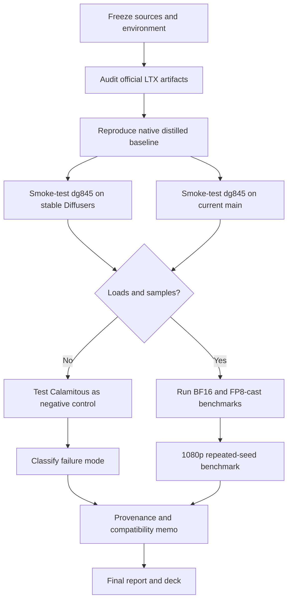
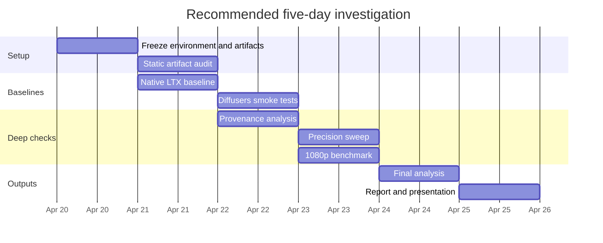

# Research Blueprint for LTX-2.3 Distilled Diffusers Compatibility

## Executive Summary

The uploaded brief shows that the “original prompt” is not actually unspecified. It is a concrete technical due-diligence request about whether a working public Diffusers-format checkpoint exists for LTX-2.3 distilled inference; whether `dg845/LTX-2.3-Distilled-Diffusers` is truly distilled rather than base weights in disguise; and what Diffusers version is minimally required, all in the context of an `LTX-2.3-distilled-lora-384` + 8-step + 1080p workflow on a single entity["company","NVIDIA","gpu company"] L40S 48 GB GPU. The brief also records specific tensor-shape mismatch failures and a known-good native command path. fileciteturn0file0

The strongest current conclusion is that there is **no official Diffusers-format LTX-2.3 repository published by** entity["company","Lightricks","ai company"] **today**. The official `Lightricks/LTX-2.3` model card still says “LTX-2.3 support in the Diffusers Python library is coming soon,” recommends ComfyUI or the native `ltx-pipelines` codebase for local use, and lists raw single-file checkpoints rather than an official Diffusers directory layout. Community discussions on the official model page also note that upstream support was merged while the official model repos themselves still lacked `model_index.json` for direct Diffusers loading. citeturn47view0turn42view0turn34view0turn34view1

There does, however, appear to be at least one **plausible unofficial public conversion**: `dg845/LTX-2.3-Distilled-Diffusers`. It contains a Diffusers `model_index.json`, uses `LTX2Pipeline`, and its transformer config matches the current upstream LTX-2.3 conversion script on several high-signal fields, including `caption_channels=3840`, `rope_type="split"`, and the 2.3 `LTX2VocoderWithBWE` path. The repo also differs from the corresponding dg845 base repo at both total size and shard checksum level, which is strong evidence that it is not simply a renamed copy of the base conversion. citeturn18view0turn19view0turn39search2turn17view0turn14view2turn20view0turn20view1

By contrast, `CalamitousFelicitousness/LTX-2.3-distilled-Diffusers` is lower-confidence as a research target. Its config diverges materially from the upstream 2.3 converter’s expected structure, including `caption_channels=4096` instead of `3840`, `rope_type="interleaved"` instead of `"split"`, and `LTX2Vocoder` instead of `LTX2VocoderWithBWE`. That does not prove it is unusable, but it does make it a much more plausible source of the architecture/config skew seen in the reported mismatch traces. citeturn31view0turn30view0turn39search2

For versioning, the public community repos are tagged with `_diffusers_version: "0.37.0.dev0"`, while the current Diffusers documentation exposes an `LTX-2` pipeline on `main` and `v0.37.1`, and upstream code is explicitly annotated with “Add Support for LTX-2.3 Models (#13217).” The conservative operational recommendation is therefore: **test on the newest stable Diffusers first, and keep current `main` as the fallback**. The most defensible “minimum evidenced” floor is `0.37.0.dev0`-era code, but the safest practical target today is `0.37.1+` or current `main`, not an older 0.32.x or early 0.37.x environment. citeturn18view0turn15view0turn25view0turn25view1turn39search1turn37view0

## Scope and Assumptions

This report treats the task as a **scoped technical compatibility investigation**, not an unconstrained open-topic study, because the uploaded brief supplies a precise problem statement, target hardware, observed error signatures, and a concrete native reference command. fileciteturn0file0

| Assumption | Status | Rationale |
|---|---|---|
| Original prompt scope | Specified | The uploaded brief defines exact checkpoints, errors, hardware, and questions. |
| Target hardware | Single L40S 48 GB | Explicit in the brief. |
| Date reference | 2026-04-19 Asia/Manila | Required by the task framing. |
| Success criterion | Reproducible loading plus inference evidence | The original questions are about “working today,” provenance, and version floor. |
| Official Diffusers support state | Ambiguous and transitional | Upstream support exists, official model card still says “coming soon.” |
| Distilled variant version | Partly unspecified | The official card lists both distilled v1.0 and distilled v1.1; community conversion provenance is not always explicit. |

The most useful scopes to distinguish are shown below.

| Interpretation of the original prompt | What it would study | Priority |
|---|---|---|
| Narrow compatibility audit | Which public repo loads and samples successfully now | Highest |
| Provenance audit | Whether dg845 is genuinely distilled and from which official artifact | Highest |
| End-to-end production viability | Whether Diffusers can replace native `ltx-pipelines` for 1080p 8-step work on L40S | High |
| Broader ecosystem scan | ComfyUI, native PyTorch, FP8, LoRA, and upscaler alternatives | Medium |
| Long-horizon library tracking | Waiting for official Lightricks/Hugging Face packaging convergence | Medium |

A critical assumption for planning is that **native LTX should be treated as the baseline**, because official current docs recommend native pipelines and ComfyUI, not Diffusers, for local inference today. citeturn47view0turn42view0turn35search0turn35search3

## Current Evidence and Preliminary Conclusions

Official LTX-2.3 distribution and official Diffusers readiness are not the same thing. The official model card lists `ltx-2.3-22b-dev`, `ltx-2.3-22b-distilled`, `ltx-2.3-22b-distilled-1.1`, the distilled LoRA variants, and the upscalers, but it still directs users to ComfyUI or the native PyTorch codebase and states that Diffusers support is “coming soon.” The official discussion thread additionally records that support had been merged upstream while the model repo itself still lacked Diffusers-compatible packaging. citeturn47view0turn34view0turn34view1

### Public artifacts to prioritize

| Artifact | Officiality | What the evidence currently says | Research value |
|---|---|---|---|
| `Lightricks/LTX-2.3` | Official | Raw single-file repo; official card says Diffusers support is “coming soon”; official discussion notes missing `model_index.json` for direct loading. citeturn47view0turn34view0turn34view1 | Baseline source of truth |
| Native `ltx-pipelines` DistilledPipeline | Official | Explicit two-stage distilled pipeline: 8 sigmas in stage 1 and 4 in stage 2; best current official “fastest inference” path. citeturn8view0turn35search2turn8view3 | Gold-standard functional baseline |
| `dg845/LTX-2.3-Distilled-Diffusers` | Unofficial community conversion | Has `model_index.json`, uses `LTX2Pipeline`, config matches upstream 2.3 converter, and differs from dg845 base conversion by shard checksum. citeturn18view0turn19view0turn39search2turn20view0turn20view1 | Best candidate for immediate Diffusers testing |
| `CalamitousFelicitousness/LTX-2.3-distilled-Diffusers` | Unofficial community conversion | Model card says converted to Diffusers, but config diverges from upstream 2.3 converter in several key fields. citeturn28view0turn30view0turn31view0turn39search2 | Useful as negative control |
| Official ComfyUI-LTXVideo workflows | Official ecosystem integration | Current docs and repo list LTX-2.3 workflows including “Text/image to video distilled model; two stages (with upsampling).” citeturn23search0turn35search3 | Evidence that working public 2.3 distilled workflows exist outside Diffusers |

### Best current answers to the original three questions

| Original question | Best current answer | Confidence |
|---|---|---|
| Is there any public Diffusers-formatted checkpoint that “just works” today? | **Yes, probably unofficially; no, not officially.** The strongest public candidate is dg845’s distilled conversion, but there is still no official Lightricks Diffusers-packaged repo as of 2026-04-19. citeturn18view0turn19view0turn47view0turn34view1 | Medium-high |
| Is `dg845/LTX-2.3-Distilled-Diffusers` actually distilled, or base weights in disguise? | **Most likely genuinely distinct from base**, because the repo differs from dg845’s base conversion by checksum and packaging size, and its config aligns with the upstream 2.3 conversion logic. But this is still not cryptographic proof against the official single-file distilled checkpoint. citeturn20view0turn20view1turn17view0turn14view2turn19view0turn39search2 | High for “not base clone”; medium for precise provenance |
| What is the minimum Diffusers version? | **Minimum evidenced floor: 0.37.0.dev0-era code. Safer practical floor: 0.37.1+ or current main.** Public repos declare `0.37.0.dev0`, while upstream LTX-2.3 support is tied to post-merge mainline code and the docs ship on `main` and `v0.37.1`. citeturn18view0turn15view0turn25view0turn25view1turn39search1turn37view0 | Medium |

### Why the reported mismatches matter

The user’s reported failures involve `scale_shift_table` shapes like `[9, 4096]` versus code expecting `[6, 4096]`, and `time_embed.linear.weight` shapes like `36864 x 4096` versus `24576 x 4096`. Those are not random corruption signatures. Current upstream Diffusers LTX code still defines a six-row `scale_shift_table` in transformer blocks and an `AdaLayerNormSingle` linear layer that emits `6 * embedding_dim`; for `embedding_dim = 4096`, that is exactly `24576`. Independent community traces show the same `9 vs 6` mismatch pattern. In other words, the observed failure mode is strongly consistent with an **architecture or conversion mismatch** between checkpoint and loader, not merely a bad download. fileciteturn0file0 citeturn26view0turn26view1turn27search1turn46view0

That observation is precisely why the research plan should not begin with cinematic prompt experimentation. It should begin with **artifact verification, config comparison, and smoke tests**.

## Research Questions and Hypotheses

The recommended research program should prioritize the following questions in order.

| Priority | Research question | Working hypothesis |
|---|---|---|
| Highest | Does `dg845/LTX-2.3-Distilled-Diffusers` load and generate on a post-LTX-2.3 Diffusers build without tensor-shape errors? | Yes, if tested on an appropriate `0.37.1+` or `main` environment with the expected dependencies. |
| Highest | Is dg845’s “distilled” repo materially different from dg845’s “base” repo? | Yes; the available file-hash and size evidence already indicates that it is not a straight copy of the base conversion. |
| High | Is dg845’s conversion derived from official distilled v1.0 or distilled v1.1? | The public evidence is insufficient; version provenance is likely the biggest remaining uncertainty. |
| High | Does the native `DistilledPipeline` remain the fastest and least risky path for 1080p 8-step work on one L40S? | Yes; official docs and current ecosystem guidance both point there. |
| High | Are Calamitous’s conversion artifacts more likely than dg845’s to trigger the reported `9 vs 6` or `36864 vs 24576` mismatches? | Yes, because the exposed config diverges more sharply from the current upstream 2.3 conversion logic. |
| Medium | Does FP8 improve feasibility on an L40S without introducing unacceptable instability? | Probably yes with `fp8-cast`; less clear for `fp8-scaled-mm`, which official docs describe as best on Hopper. |

The target deliverable should not merely state “works” or “does not work.” It should produce a **compatibility matrix** with four dimensions: artifact, loader version, precision mode, and result class. That is the shortest path to a defensible conclusion.

## Methodology and Data Sources

The evidence hierarchy should be strict. Primary sources should dominate: official model cards, official docs, official source repositories, upstream conversion scripts, release notes, and vendor hardware documentation. Community model repos and issue threads should be used only for corroboration or negative controls. That hierarchy is justified here because the official LTX materials, the upstream Diffusers code, and official GPU/provider documentation already expose most of the load-bearing facts. citeturn47view0turn42view0turn8view0turn39search2turn25view0turn43search0turn44search1

### Source tiers

| Source tier | Examples to prioritize | What it is good for |
|---|---|---|
| Primary official model sources | `Lightricks/LTX-2.3`, `Lightricks/LTX-2.3-fp8`, LTX docs, LTX-2 GitHub repo | Ground truth on intended checkpoints, pipeline design, official guidance, licensing |
| Primary upstream implementation sources | Diffusers docs, release notes, `convert_ltx2_to_diffusers.py`, `transformer_ltx.py` | Precise loader behavior, version floor, config expectations |
| Artifact metadata sources | `model_index.json`, `config.json`, shard sizes, Xet/SHA256 pointer details | Provenance and invariance checks without full downloads |
| Vendor hardware sources | NVIDIA L40S product docs | Precision support and hardware capability assumptions |
| Pricing sources | RunPod, Vast.ai | Current compute-budget estimates |
| Secondary/community corroboration | Repo issues, community conversions, external loader failures | Pattern matching, edge-case reproduction, negative-control evidence |

### Method comparison

| Method | Purpose | Strength | Weakness | Use when |
|---|---|---|---|---|
| Static artifact audit | Compare configs, model indices, hashes, file structures | Fast, cheap, high signal | Cannot prove functional generation | Always first |
| Native baseline reproduction | Validate official path on same hardware | Establishes true baseline | Does not answer Diffusers question directly | Always second |
| Diffusers smoke tests | Check whether candidate repos load and produce one output | Directly answers “works today” | Sensitive to environment drift | Third |
| Provenance audit | Compare hashes, metadata, version markers, conversion logic | Best available non-invasive provenance method | Still cannot fully prove source file ancestry | In parallel with smoke tests |
| Benchmark matrix | Measure latency, VRAM, success rate, output quality | Converts anecdote into evidence | Highest time and compute cost | After at least one candidate works |

### Recommended toolchain

The most appropriate tool stack is straightforward: `huggingface_hub` for fetching artifacts, `safetensors` for metadata and integrity checks, Diffusers from a pinned release plus current `main`, the native `ltx-pipelines` environment, `sha256sum` or equivalent for local verification, `nvidia-smi` and `torch.cuda.max_memory_reserved()` for memory measurement, and a structured logging harness that records wall time, seed, precision, dimensions, frame count, and output status. Official LTX docs also identify `fp8-cast` as the portable memory-saving mode and `fp8-scaled-mm` as the Hopper-optimized path, which makes `fp8-cast` the natural precision experiment on L40S. citeturn8view2turn42view0turn35search0turn43search0turn43search14

## Research Plan, Timeline, and Budget

The plan below assumes one researcher, one L40S 48 GB GPU, and no pre-existing local cache.

### Work breakdown

| Phase | Main tasks | Person-hours | GPU-hours | Primary deliverable |
|---|---|---:|---:|---|
| Source freeze | Pin checkpoint names, repo revisions, Diffusers refs, CUDA/PyTorch env | 4 | 0 | Reproducibility manifest |
| Artifact audit | Compare official and community `model_index.json`, `config.json`, hashes, file structures | 6 | 0 | Provenance memo |
| Native baseline | Reproduce official `ltx-pipelines` distilled path on L40S | 8 | 4–8 | Baseline run logs and one verified output |
| Diffusers smoke tests | Test dg845 and Calamitous on stable + main | 10 | 6–10 | Compatibility matrix |
| Precision sweep | BF16 and FP8-cast on the winning path | 6 | 4–8 | VRAM/latency comparison |
| 1080p benchmark | Run repeated seeds at target resolution and 8-step recipe where applicable | 12 | 12–20 | Benchmark table |
| Analysis and synthesis | Interpret results, write memo, produce deck | 10 | 0 | Final report and presentation |

A realistic total is **56 person-hours** and **26–46 GPU-hours** for a medium-confidence investigation.

### Milestones

| Milestone | Exit criterion | Estimated elapsed time |
|---|---|---|
| Baseline locked | Native official run succeeds on target hardware | Day 1 |
| Candidate selected | At least one Diffusers repo loads cleanly and emits one valid sample | Day 2 |
| Provenance position set | dg845 assessed as probable distilled / uncertain / rejected, with evidence | Day 3 |
| Benchmark complete | Latency, VRAM, success rate, and sample outputs gathered | Day 4 |
| Final synthesis complete | Written report and slide deck drafted | Day 5 |

### Budget scenarios

The table below is **compute-only**, because labor rates are organization-specific and genuinely unspecified. A simple way to extend it is: `total budget = compute cost + (internal hourly labor rate × person-hours)`.

| Scenario | Scope | GPU-hours | Approx. compute cost |
|---|---|---:|---:|
| Low | Artifact audit + native baseline + one Diffusers smoke test | 10–15 | about **$5–$13** |
| Medium | Full compatibility matrix + BF16/FP8-cast + limited 1080p test | 26–46 | about **$14–$40** |
| High | Repeated 1080p runs, larger seed set, negative controls, deck polish | 60–100 | about **$32–$86** |

These estimates assume an external L40S rate roughly in the **$0.53/hr to $0.86/hr** band based on current marketplace and provider pricing, with RunPod also listing on-demand L40S around **$0.79/hr**. Prices will vary by provider, region, reservation type, and availability. citeturn44search1turn44search3turn44search6

### Workflow diagram

### Timeline diagram

## Data Collection and Analysis Framework

### Collection protocol

For each tested path, collect one standardized record per run:

| Field | Description |
|---|---|
| Artifact ID | Official single-file, dg845 distilled, dg845 base, Calamitous distilled |
| Loader path | Native `ltx-pipelines`, Diffusers stable, Diffusers main |
| Precision | BF16, FP8-cast |
| Resolution and frames | Exact width, height, frame count, and fps |
| Step schedule | 8-step distilled, stage-2 sigma list, any LoRA strength |
| Outcome | Loaded, sampled, decoded, failed at load, failed at denoise, failed at decode |
| Latency | Time to load, time to first frame, total wall time |
| Memory | Peak VRAM reserved and allocated |
| Integrity | SHA256/hash provenance status |
| Output QA | Manual notes plus automated basic checks |

The minimum sensible matrix is:

- 2 loader branches: stable Diffusers, current main  
- 2 candidate community repos: dg845 distilled, Calamitous distilled  
- 2 precisions where feasible: BF16, FP8-cast  
- 2 resolutions: 540p pilot, 1080p target  
- 5 seeds per successful condition

That yields an evidence base strong enough for a practical decision without becoming a full-scale benchmark campaign.

### Metrics

The most decision-relevant metrics are operational before they are aesthetic:

| Metric family | Suggested metric |
|---|---|
| Compatibility | Load success rate, first successful sample rate, decode success rate |
| Performance | Median total wall time, p95 wall time, time to first sample |
| Memory | Peak VRAM reserved, peak VRAM allocated, OOM rate |
| Fidelity to requested setup | Whether the exact checkpoint, sigma schedule, LoRA, upscaler, and resolution were honored |
| Output validity | Correct dimensions, frame count, audio presence, absence of silent failure |
| Quality | Prompt adherence rubric, motion coherence rubric, artifact severity rubric |

For quality assessment, the lowest-friction method is a **blinded pairwise human rating** across a small prompt set, because the real decision here is not publication-grade benchmarking. It is whether a Diffusers path is trustworthy enough to replace the native stack for the user’s workflow.

### Statistical approach

A rigorous but lightweight analysis package is sufficient:

| Question type | Recommended analysis |
|---|---|
| Mean latency / VRAM differences | Bootstrap 95% confidence intervals; paired Wilcoxon signed-rank if runs are seed-matched |
| Failure-rate comparison | Wilson intervals for proportions; two-proportion test if sample sizes justify it |
| Pairwise preference | Sign test or Bradley–Terry model if enough comparisons are collected |
| “Equivalent enough” operational comparison | Pre-register acceptable margins, then use equivalence framing rather than only null-hypothesis tests |

The key methodological discipline is to **pre-register failure classes** before testing. Otherwise, “works” may hide a mixture of partial-load cases, silent decode degradation, or non-target schedule substitutions.

## Risks, Ethics, and Final Deliverables

### Risks and limitations

| Risk | Why it matters | Mitigation |
|---|---|---|
| Official support ambiguity | Official cards still say Diffusers is “coming soon,” even though upstream support exists. citeturn47view0turn42view0turn34view0 | Treat native LTX as baseline and Diffusers as experimental |
| Provenance uncertainty | dg845 appears distinct from base, but exact ancestry to official distilled v1.0/v1.1 is not yet cryptographically proven. citeturn20view0turn20view1turn47view0 | Re-run conversion locally if absolute proof is required |
| Version ambiguity | Official model card lists both distilled and distilled-1.1 variants. citeturn47view0 | Record checkpoint hash and variant explicitly in every run |
| Architecture skew | The `9 vs 6` modulation mismatch is a real failure mode, not a theoretical concern. fileciteturn0file0 citeturn26view0turn27search1turn46view0 | Start with static config audit before expensive inference |
| GPU-cost variability | Cloud L40S pricing is market-dependent. citeturn44search1turn44search3turn44search6 | Present compute-only ranges, not false precision |

### Ethical and governance considerations

The official model cards explicitly warn about bias amplification, inappropriate or offensive content, and imperfect prompt following. In addition, the models are governed by the LTX community license. A serious research report should therefore avoid treating unofficial conversions as “official,” should document exact artifact provenance, and should keep any public benchmark prompts free of harmful or disallowed content. citeturn47view0turn42view0

### Suggested final report structure

| Final report section | What it should contain |
|---|---|
| Problem statement | The exact original questions, hardware target, observed errors |
| Source-of-truth map | Official artifacts, unofficial conversions, version branches |
| Compatibility findings | Load matrix, sample matrix, failure taxonomy |
| Provenance assessment | Evidence for or against “distilled” status of dg845 |
| Performance findings | Latency, VRAM, precision mode, 1080p feasibility |
| Recommendation | Native-only, Diffusers-viable, or wait-for-official |
| Repro appendix | Commands, hashes, versions, seeds, hardware snapshot |

### Suggested presentation materials

| Slide | Contents |
|---|---|
| Executive brief | One-slide answer to Q1–Q3 |
| Artifact map | Official vs unofficial repos and what each contains |
| Failure anatomy | Visual explanation of `9 vs 6` and `36864 vs 24576` mismatch classes |
| Benchmark summary | Latency, VRAM, success rate by path |
| Recommendation | Decision tree: native baseline, dg845 test path, fallback plan |
| Appendix | Version manifest, hashes, commands |

### Prioritized bibliography and search queries

| Priority | Source to use | Why it matters | Suggested search query |
|---|---|---|---|
| Highest | Lightricks LTX-2.3 model card and files. citeturn47view0turn22search7 | Official checkpoint list, variant names, support status, license context | `site:huggingface.co Lightricks/LTX-2.3 model card Diffusers coming soon` |
| Highest | LTX Documentation PyTorch API. citeturn35search0 | Official native baseline, available pipelines, configuration guidance | `site:docs.ltx.video PyTorch API DistilledPipeline LTX-2.3` |
| Highest | Lightricks LTX-2 GitHub README and `ltx-pipelines` README. citeturn8view1turn8view0turn8view2turn8view3 | Official required models, stage structure, sigma schedules, FP8 guidance | `site:github.com/Lightricks/LTX-2 DistilledPipeline DISTILLED_SIGMA_VALUES fp8-cast` |
| Highest | Diffusers release notes and LTX-2 docs. citeturn25view0turn25view1turn37view0 | Version floor and public support timeline | `site:github.com/huggingface/diffusers releases LTX-2 0.37.0 0.37.1` |
| Highest | Diffusers LTX-2.3 converter and transformer implementation. citeturn39search2turn26view0turn27search1 | Canonical expected config fields and loader behavior | `site:github.com/huggingface/diffusers "Add Support for LTX-2.3 Models" convert_ltx2_to_diffusers` |
| High | dg845 distilled and base repos. citeturn18view0turn19view0turn17view0turn14view2turn20view0turn20view1 | Strongest public provenance and compatibility evidence | `site:huggingface.co dg845 LTX-2.3-Distilled-Diffusers transformer config model_index` |
| High | Calamitous distilled repo. citeturn28view0turn29view0turn30view0turn31view0 | Negative-control artifact for config-skew analysis | `site:huggingface.co CalamitousFelicitousness LTX-2.3-distilled-Diffusers config` |
| High | NVIDIA L40S hardware documentation. citeturn43search0turn43search14 | Hardware capability assumptions, FP8 plausibility | `site:nvidia.com L40S Ada FP8 tensor cores` |
| Medium | LTX-2 paper metadata. citeturn47view0 | Background and architecture context | `"LTX-2: Efficient Joint Audio-Visual Foundation Model" arXiv 2601.03233` |
| Medium | Current L40S provider pricing. citeturn44search1turn44search3turn44search6 | Budgeting and effort planning | `RunPod L40S price` and `Vast.ai L40S price` |

The central recommendation is simple: **anchor the investigation in the official native baseline, test dg845 first on current Diffusers, treat Calamitous as a negative control, and do not represent any community conversion as official until provenance has been demonstrated at the artifact level.** That is the shortest path to a rigorous answer that is technically useful and easy to defend.