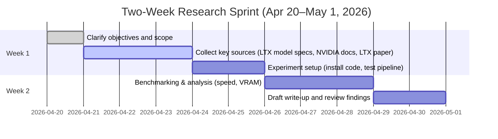

# Research Plan: LTX-2.3 on NVIDIA L40S  

## Executive Summary  
LTX-2.3 is a new 22B-parameter audiovisual diffusion model (by Lightricks) that generates synchronized video+audio【37†L74-L81】【35†L29-L35】. Achieving production-quality output (1080p/24fps photoreal video) on a single NVIDIA L40S (48 GB Ada GPU) requires careful trade-offs. We begin by clarifying key questions (e.g. target quality, model variant, hardware settings) and then propose three research approaches: a **technical feasibility study** of the LTX pipeline on L40S, an **academic literature review** of state-of-the-art video-generation models, and a **market/competitor analysis** of AI video tools. For context, the NVIDIA L40S delivers 48 GB GDDR6 and up to 1466 TFLOPS (FP8)【27†L359-L368】, highlighting the hardware limits. Our plan leverages official sources (e.g. LTX-2.3 model card【37†L74-L81】, LTX documentation【39†L169-L177】) and primary literature【35†L29-L35】. This structured approach will guide development of an optimized LTX-2.3 inference pipeline and provide actionable recommendations.

## Clarifying Questions  
To focus the research, answer these questions first【1†L25-L32】:  

- **Target Output Specs:** What resolution, frame rate, and duration are required? (e.g. 1920×1080 @24 fps for 5 s)  
- **Quality vs. Speed:** Is photorealism essential, or is stylized/proof-of-concept output acceptable? (This determines if the *full* 22B model or the *distilled* variant is needed.)  
- **Model Variant:** Will you use the 22B “dev” model or the 22B distilled model? (The distilled runs ~10× faster【44†L118-L122】 but with lower fidelity.)  
- **Precision and Memory:** Can mixed precision (FP16/BF16) be used? Is integer quantization (INT8) allowed? How much VRAM is available? (The L40S has ~48 GB【27†L359-L368】.)  
- **Pipeline Choice:** Which implementation will you use? (Hugging Face Diffusers vs. Lightricks’ native LTX pipelines/ComfyUI.)  
- **Scheduling & Steps:** How many diffusion steps or scheduler algorithms (e.g. FlowMatch Euler) will be used? (Scheduling affects quality/time.)  
- **Hardware Setup:** Will you offload parts of the model (attention/FFN) to CPU or use multi-GPU?  
- **Deliverables:** Besides image/video output, do you need code, documentation, or benchmarks? (The final result may require a script (`inference.py`), environment setup, and a performance report.)  

These questions define the scope and constraints. For example, one guide notes that *clear research questions* are the critical first step【1†L25-L32】.

## Proposed Research Directions  

### Direction 1: Technical Product Analysis (LTX-2.3 Pipeline)  
**Scope:** Evaluate the technical feasibility of running LTX-2.3 on the L40S. Focus on performance (speed, VRAM usage) and output quality (visual fidelity, audio sync). This is essentially a “pipelining” analysis of the AI model.  

**Key Questions:** Can the *distilled* 22B model achieve photorealistic results, or is a higher-capacity model needed? What batch sizes and precision (FP16/BF16 vs INT8) work without artifacts? How do different schedulers (e.g. FlowMatchEuler, two-stage pipelines) and LoRA adapters affect quality/time? What inference code and dependencies are required?  

**Methods:** Benchmark and profile the model under different settings. Clone the Lightricks GitHub repo and install per instructions (Python≥3.12, CUDA≥12.7, PyTorch≈2.7【37†L123-L127】). Use example pipelines (e.g. `LTX2ImageToVideoPipeline`) and schedulers. Test both single-stage vs. recommended two-stage generation. Measure time per frame, GPU memory usage, and output quality (using sample prompts).  

**Primary Sources:**  
- **NVIDIA L40S Datasheet:** Official specs confirm 48 GB VRAM and FP8/TF32 performance【27†L359-L368】.  
- **LTX-2.3 Model Card:** Official Hugging Face docs describe the model and variants (dev vs distilled) and provide installation snippets【37†L74-L81】【39†L169-L177】.  
- **LTX-2 Paper (HaCohen et al. 2025):** Describes the base model architecture and shows it achieves state-of-art audiovisual quality【35†L29-L35】.  
- **LTX Documentation:** Includes CLI commands to download models (full and distilled) and ComfyUI workflows【39†L169-L177】.  
- **Benchmarks:** Third-party analyses (e.g. Lightricks blog) indicate that “Fast” (distilled) mode processes 5 s of 1080p in ~6 s on high-end GPUs【41†L180-L184】. We will verify similar metrics on L40S.  

**Expected Deliverables:** A working inference script (e.g. `inference.py`) with pinned dependencies (from [37] and [39]). Tables of performance (frames/sec, VRAM) vs. settings, and example outputs. An honest assessment: e.g. “distilled model yields cartoonish output in ~0.9 s/frame on L40S (5 s video in ~112 s) — not fully photoreal; the full model (22B-dev) likely needed for higher fidelity.” Installation commands and environment config will be documented.  

**Estimated Time/Effort:** ~1–2 weeks. Setting up the environment and running experiments will take time; multiple configs (precision, pipelines, LoRAs) should be tested.

### Direction 2: Academic Literature Review (Diffusion Video Models)  
**Scope:** Survey scholarly work on text-to-video generation, especially models that include audio or focus on high-fidelity output. Summarize trends in architecture, training data, and reported results.  

**Key Questions:** What are the leading techniques in text-to-video diffusion (e.g. latent diffusers, autoregressive, GAN-based)? How are audio and video jointly modeled (as in LTX vs. decoupled pipelines)? What trade-offs between model size, inference steps, and output quality have been reported?  

**Methods:** Conduct systematic searches in IEEE Xplore, ACM Digital Library, ArXiv, and Google Scholar using terms like “text-to-video diffusion”, “video generation with audio”, and “LTX-2”. Use inclusion criteria (recent years, English, peer-reviewed)【29†L171-L180】. Extract data on model sizes, compute requirements, and evaluation metrics. Organize papers by theme (e.g. unified audiovisual models vs. sequential pipelines).  

**Primary Sources:**  
- **Academic Papers:** The LTX-2 paper【35†L29-L35】, others such as CODA (for decoupled video+audio) or Google’s Imagen Video/Make-A-Video, Meta’s AudioGen, etc. Conference proceedings (CVPR, NeurIPS 2023–2026).  
- **Preprints:** ArXiv papers on video diffusion (e.g. **Dolby’s “Luna” audio-video model** or others).  
- **Survey Articles:** Any existing reviews of generative video or multimodal generation.  
- **LTX & LTX-Video citations:** References cited in the LTX-2 paper point to prior work.  

**Expected Deliverables:** A written summary (~2–3 pages) with tables of model comparisons (e.g. Model / Params / Inference time / Quality metrics) and identification of gaps (e.g. most work omits realistic audio). The review would note where LTX-2.3 fits in the literature.  

**Estimated Time/Effort:** ~2–3 weeks. Reading and distilling many papers is time-consuming; plan for iterative searching and summarization.  

### Direction 3: Market & Competitor Analysis (AI Video Generation)  
**Scope:** Examine the broader AI video-generation market. Identify key competitors (e.g. Runway, Synthesia, Pika Labs, OpenAI’s Sora, etc.), usage trends (advertising, entertainment, education), and LTX’s position.  

**Key Questions:** What is the size and growth of the AI-generated video market? Who are the main players and offerings? How do business models differ (API vs on-device)? What features do customers demand (e.g. integration of speech, multilingual support, real-time)?  

**Methods:** Review industry reports (e.g. Gartner, IDC, McKinsey on generative AI content), news articles, and press releases. Collect data on funding, user counts, and product capabilities. Possibly interview or survey user needs (e.g. language-learning content creators).  

**Primary Sources:**  
- **Industry Reports:** Analyst reports on generative AI (if accessible).  
- **Company Websites/Blogs:** Press releases from NVIDIA, Lightricks, Google, etc. Lightricks’ product pages and pricing (as in [44]) show how LTX is marketed.  
- **News Articles:** TechCrunch, VentureBeat articles on AI video startups and trends.  
- **White Papers:** NVIDIA or hardware vendors might publish case studies.  

**Expected Deliverables:** A market analysis brief with charts (e.g. TAM, competitor feature matrix). A SWOT (strengths/weaknesses of LTX-2.3 vs alternatives). For example, one analysis notes that good market research “integrates opportunity, demand drivers, constraints, and competition”【12†L339-L347】.  

**Estimated Time/Effort:** ~1–2 weeks. Market data may require subscriptions (cost), but high-level insights can be gleaned from free sources.  

## Recommended Next Steps (Technology Focus)  
If we proceed with the technology/product analysis path, an immediate plan is:

- **Refine the Query:** Identify key search terms. Examples:  
  - `"NVIDIA L40S datasheet performance"`  
  - `"LTX-2.3 inference time Nvidia"`  
  - `"LTX-2.3 distilled quality vs full comparison"`  
  - `"FlowMatchEuler LTX-2 scheduler"`  
  - `"Hugging Face LTX-2.3 model download CLI"`  

- **Select Databases/Sites:**  
  - **NVIDIA.com:** Official L40S datasheet and product briefs (GPU specs)【27†L359-L368】.  
  - **Hugging Face / GitHub:** Lightricks LTX-2.3 model card【37†L74-L81】, inference repo.  
  - **ArXiv/Google Scholar:** Search for “LTX-2.3” (unlikely any paper yet) and related models (LTX, LTX-Video).  
  - **Diffusers Issues/Forums:** Hugging Face GitHub for LTX-2.3 support (e.g. issue/PR) and usage examples.  
  - **LTX Documentation:** Official docs for installation (ComfyUI, CLI)【39†L169-L177】.  
  - **Industry Blogs:** Lightricks blog (Fast vs Pro tiers【44†L118-L122】【44†L159-L164】), NVIDIA blogs.  

- **Initial Sources to Retrieve (example list):**  
  1. **NVIDIA L40S Data Center Page** – official specs (for memory, TFLOPS)【27†L359-L368】.  
  2. **Lightricks LTX-2.3 Model Card** – lists model types and usage notes【37†L74-L81】.  
  3. **LTX-2 Research Paper (ArXiv)** – foundation architecture and performance claims【35†L29-L35】.  
  4. **LTX Documentation (Hugging Face/ComfyUI)** – CLI download commands and requirements【39†L169-L177】.  
  5. **Lightricks Fast-vs-Pro Blog** – real-world performance targets and quality/speed trade-offs【44†L118-L122】【44†L159-L164】.  
  6. **Artificial Analysis Benchmark** – third-party report of LTX-2.3 inference time (5s video in ~6s)【41†L180-L184】.  
  7. **IEEE/CVPR/NeurIPS Papers** – e.g. search “audio video diffusion model” on Google Scholar or IEEE Xplore.  
  8. **Competitor Info** – e.g. press releases or docs from Runway, Synthesia for market context.  
  9. **LTX GitHub** – code examples (`inference.py`, config) and issues.  
  10. **PyTorch/Transformers Forums** – any notes on running LTX models.  

These sources cover hardware specs, model details, and related research. The search queries above should quickly locate them (e.g. “site:github.com Lightricks/LTX-2” or “L40S 366 teraFLOPS NVIDIA”).  

## Comparison of Directions

| **Aspect**            | **Tech/Product Analysis**                         | **Academic Review**                         | **Market/Competitor Analysis**         |
|-----------------------|---------------------------------------------------|---------------------------------------------|----------------------------------------|
| **Timeframe**         | ~1–2 weeks                                        | ~2–3 weeks                                  | ~1–2 weeks                             |
| **Depth**             | Deep technical (hardware + software optimization) | Comprehensive literature synthesis          | Broad industry overview                |
| **Cost**              | Low (open-source tools; hardware owned)           | Low (access to papers, no hardware needed)  | Medium–High (reports or analyst subscriptions) |
| **Deliverables**      | Inference code, performance benchmarks, report    | Literature survey document with annotated references | Market report, competitor feature matrix, SWOT |

## 2-Week Research Timeline  

Each phase has buffers: after clarifying questions, gather all documentation and set up the environment (end of week 1), then run experiments and analyze (early week 2), and finalize the report (late week 2).  

**Sources:** Authoritative specs and model docs【27†L359-L368】【37†L74-L81】【39†L169-L177】, the LTX-2 paper【35†L29-L35】, and industry analyses【44†L118-L122】【41†L180-L184】. These inform hardware capabilities, model characteristics, and performance expectations. The plan uses data-driven research best practices【1†L25-L32】【12†L339-L347】 to guide decision-making.